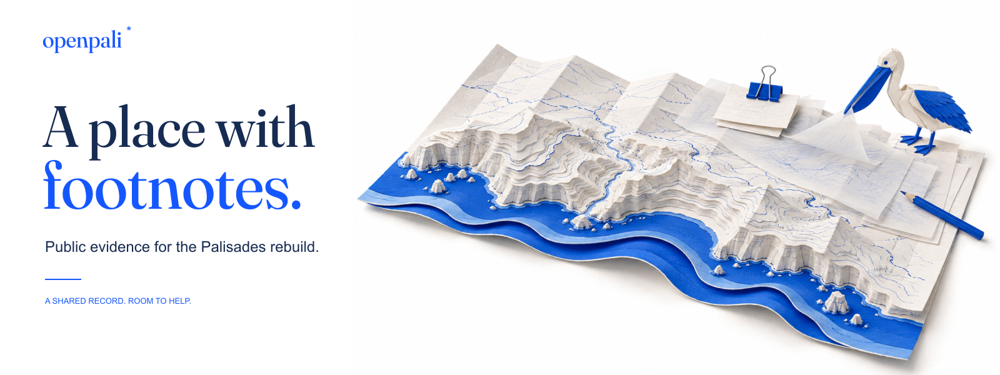

# OpenPali brand kit

**A place with footnotes.**

OpenPali's field office connects a coastal place with the work of keeping a clear public record. Its illustrated world has a layered paper atlas, tracing sheets, a blue pencil and clip, and a small paper pelican attending to a source note.



Read the [field-office guide](FIELD-OFFICE.md) for the story, character, voice, and rules for extending the family.

## Artwork

| Asset | Size | Use |
| --- | --- | --- |
| [README banner](../../assets/brand/field-office/banner.png) | 1600 × 600 | Wordmark, headline, and full coastal scene on white. |
| [Follow a source](../../assets/brand/field-office/follow-source.png) | 640 × 427 | Source research, citations, and explanations. |
| [Improve the software](../../assets/brand/field-office/build-tools.png) | 640 × 427 | Code, maps, accessibility, tests, and documentation. |
| [Question a record](../../assets/brand/field-office/correct-record.png) | 640 × 427 | A public discrepancy or an annotation preserving the original. |
| [Website hero](../../assets/brand/field-office/hero.webp) / [smaller hero](../../assets/brand/field-office/hero-900.webp) | 1536 / 900 pixels wide | Responsive image delivery. |
| [Hero source](../../assets/brand/field-office/hero-source.png) | 1536 × 1024 | Master coastal illustration for new compositions and crops. |
| [Social preview](../../assets/brand/field-office/social-card.png) | 1280 × 640 | GitHub social preview, Open Graph, and landscape announcements. |
| [Social square](../../assets/brand/field-office/social-square.png) | 1080 × 1080 | Square announcements. |
| [Wordmark](../../assets/brand/field-office/wordmark.svg) | 290 × 75 | Outlined type with the note marker. |
| [Avatar SVG](../../assets/brand/field-office/avatar.svg) / [PNG](../../assets/brand/field-office/avatar.png) | 512 × 512 | Simplified paper pelican for project accounts. |
| [Favicon](../../assets/brand/field-office/favicon.svg) | 32 × 32 | Small browser icon. |
| [Sticker](../../assets/brand/field-office/sticker.svg) | 600 × 300 | Pelican, wordmark, and “Follow the source.” |
| [ASCII companion](../../assets/brand/field-office/openpali.txt) | Plain text | A small pelican, purpose line, and field notes for terminal and developer surfaces. |

The current family lives in [`assets/brand/field-office/`](../../assets/brand/field-office/). Keep role labels as readable text beside the images. Earlier square/P experiments in the parent directory document the previous direction; use the field-office family for new artwork.

## Color and type

| Color | Hex | Role |
| --- | --- | --- |
| Cobalt | `#1557FF` | Identity and primary action. |
| Ink | `#172C52` | Readable dark text. |
| Paper | `#FFFFFF` | Canvas. |

Pale blues support the artwork and rules. Match the delivered artwork and the website's actual color tokens when extending it. Brand colors do not redefine the product's evidence-lane colors or imply recovery progress.

The website uses locally bundled **Fraunces** for editorial display type and **DM Sans** for body and interface text. The font files and their SIL Open Font License notices are in [`field-office/fonts/`](../../assets/brand/field-office/fonts/). README text uses GitHub's native typography; code and the ASCII companion use ordinary monospace.

- Keep essential text outside the raster artwork, apart from the designed banner lockup. Supply meaningful alternative text for that lockup.
- Preserve the scene's quiet white space. Do not cover the main action with tiny labels or a large mark.
- Keep the bird's proportions, atlas layers, blue accents, and paper texture consistent between pieces.
- Compose dedicated mobile and social crops. Check the source note, bird, and coastal edge at the smallest intended size.
- Use high-contrast text and visible focus indicators; pale lines belong to artwork and decoration.

## Voice

| Purpose | Copy |
| --- | --- |
| Headline | A place with footnotes. |
| Plain explanation | Public evidence for the Palisades rebuild. |
| Website action | Explore on GitHub. |
| Contribution invitation | Help make the record clearer. |
| Encouragement | Small fixes count. |

Celebrate useful work and the people doing it. Keep property evidence factual. Say what a covered source documents, preserve unknowns, and distinguish event, observation, and release dates. Avoid invented statistics, official endorsement, and promises of complete or live coverage.

The character's play belongs in research and contribution. It must not express a judgment about an owner's progress or make light of loss.

## Production and provenance

The hero and three role scenes are original AI-generated illustrations made with the built-in ImageGen tool. The simplified pelican icons, composition templates, and typography exports are code-authored. The banner and social SVG files reference the adjacent raster master, `hero-source.png`. Keep that image beside them when previewing or editing; use the PNG exports for portable sharing. The SVG files are editable compositions, not wholly vector illustrations.

[PROVENANCE.md](../../assets/brand/field-office/PROVENANCE.md) describes the source artwork and production history. [PROMPTS.json](../../assets/brand/field-office/PROMPTS.json) records generation instructions. [manifest.json](../../assets/brand/field-office/manifest.json) records the palette, tool, font licenses, and asset sizes. Role masters are preserved in [`sources/`](../../assets/brand/field-office/sources/).

Rebuild the display assets from the committed illustrations and type outlines with [export-field-office.cjs](../../scripts/export-field-office.cjs):

```sh
npm install --prefix /tmp/openpali-brand-tools sharp
NODE_PATH=/tmp/openpali-brand-tools/node_modules node scripts/export-field-office.cjs
```

The export script makes no network requests. It creates the responsive WebP hero, smaller role PNGs, banner, social images, wordmark, avatar, favicon, sticker, and manifest. It does not regenerate the original illustrations. New artwork requires a separate generation and review pass; prompts alone do not reproduce identical pixels.

For changed typography, update the text list in [generate-field-office-type.py](../../scripts/generate-field-office-type.py) and run it with Python, FontTools, and Brotli installed before exporting. It rebuilds `type-outlines.json` from the bundled Fraunces font.

The website build uses committed assets and does not install Sharp. Review desktop, mobile, and social crops after any source or composition change.

## Image meaning and rights

The coastal paper scene is **illustrative artwork**, not a terrain survey, map of property conditions, or recovery measurement. Its lines and paper layers carry no data meaning. A future asset derived from actual geography needs its own source, extent, dates, and attribution.

This artwork was made for OpenPali. The reference projects informed the idea of a coherent visual world; their characters, artwork, and marks are not included. This guide grants no trademark or asset license. Follow the repository's [current licensing notice](../../README.md#license-and-data-rights); government records, imagery, basemaps, and vendor-derived assets have separate terms.

## Further reading

- [The field office: story, roles, and applications](FIELD-OFFICE.md)
- [Round-two strategy and acceptance criteria](../../design-lab/round-2/STRATEGY.md)
- [Round-two reference research](../../design-lab/round-2/RESEARCH.md)
- [Original reference study](REFERENCES.md)
- [Project launch plan](PLAN.md)
- [Launch materials and repository settings](LAUNCH.md)
