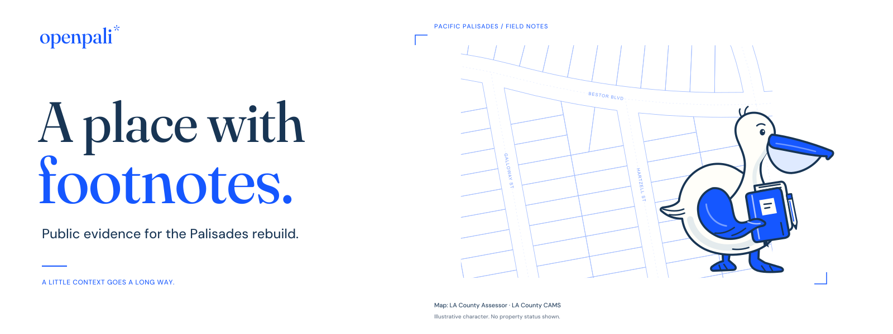

# OpenPali brand kit

**A place with footnotes.**

The current **Field Notes** direction pairs a flat white-and-cobalt pelican, a field notebook, and actual Pacific Palisades parcel lines. The bird observes and annotates; the geography stays fixed. The implementation is pending review in [PR #12](https://github.com/Andrewwilliamross/openpali/pull/12), rather than a claim about the currently published main branch.



## Current assets

The active artwork is in [`assets/brand/field-notes-2d/`](../../assets/brand/field-notes-2d/).

| Asset | Size | Use |
| --- | --- | --- |
| [README banner](../../assets/brand/field-notes-2d/banner.png) / [SVG](../../assets/brand/field-notes-2d/banner.svg) | 1600 × 600 | Project introduction. |
| [Social preview](../../assets/brand/field-notes-2d/social-card.png) / [SVG](../../assets/brand/field-notes-2d/social-card.svg) | 1280 × 640 | GitHub and Open Graph preview. |
| [Avatar PNG](../../assets/brand/field-notes-2d/avatar.png) / [SVG](../../assets/brand/field-notes-2d/avatar.svg) | 512 × 512 | Project account artwork. |
| [Favicon](../../assets/brand/field-notes-2d/favicon.svg) | 32 × 32 | Browser icon. |
| [Pelican rig](../../assets/brand/field-notes-2d/pelican.svg) | 260 × 260 | Editable character groups and animation hooks. |
| [Website scene](../../assets/brand/field-notes-2d/scene.svg) | 1100 × 850 | Composed flat drawing, character, and margin study. |
| [Close parcel drawing](../../assets/brand/field-notes-2d/map/close/alphabet-streets-linework.svg) | 1100 × 720 | Attributed, stationary map layer. |

The earlier square/P studies and layered paper-atlas artwork are archival. The former website is preserved in [`design-lab/round-2/field-office/`](../../design-lab/round-2/field-office/). Its [Field Office guide](FIELD-OFFICE.md) records that earlier direction. The shared font files still live in [`field-office/fonts/`](../../assets/brand/field-office/fonts/).

## Color, type, and voice

Use white `#FFFFFF`, cobalt `#1557FF`, dark blue text, and pale blue drawing lines. **Fraunces** supplies editorial type; **DM Sans** supplies body and interface text. Both fonts are locally bundled with SIL Open Font License notices. Follow the delivered scene and site tokens when extending the artwork.

| Purpose | Copy |
| --- | --- |
| Headline | A place with footnotes. |
| Explanation | Public evidence for the Palisades rebuild. |
| Primary action | Explore on GitHub. |
| Contribution invitation | Help make the record clearer. |

Keep essential text readable outside the illustration. Preserve the pelican’s long bill, soft pouch, rounded body, held notebook, and separate feet. Use clear ink shapes and purposeful pauses. Humor belongs in the character’s work; it should never judge a household’s recovery or make light of loss.

## Motion and production

The website uses an inline SVG and a shared 26-second JavaScript timeline. The pelican waddles, inspects, lifts its pencil, underlines a margin note, and returns. Visitors can pause and resume. Reduced-motion mode starts still and offers **Play once**; hidden or offscreen scenes suspend the clock. The map itself does not move.

Recompose the scene and stage the website with Python’s standard library:

```sh
python3 scripts/compose-field-notes.py
python3 scripts/build-site.py
```

The composer reads the committed pelican and close parcel SVG. The site builder inserts the resulting scene into HTML and stages only its explicit asset allowlist. There is no runtime renderer package or external map fetch.

For banner, avatar, favicon, and social changes, [`generate-assets.py`](../../assets/brand/field-notes-2d/generate-assets.py) creates self-contained SVG compositions with outlined type; it requires FontTools with WOFF2 support. [`export-assets.cjs`](../../assets/brand/field-notes-2d/export-assets.cjs) rasterizes the PNGs with Sharp. Those authoring dependencies are separate from the website build. Review the smallest intended size after exporting.

## Geography and illustration

The close drawing uses 61 general County parcel features, plus named CAMS street lines around Galloway, Hartzell, and Bestor. The [geography record](../../design-lab/round-3/GEOGRAPHY.md) preserves the extent, source coordinates, queries, hashes, projection, terms, and rebuild recipe.

Keep this credit with compositions that contain the map: **Map: LA County Assessor · LA County CAMS**. Retain the full source references in accompanying documentation or metadata. The County data terms are separate from the rights to the new artwork and software.

The character, pencil action, margin annotations, and architectural study are illustrative. Keep the architectural study separate from real parcel boundaries and labeled as such. Do not draw invented buildings onto specific lots or turn animation into recovery-status evidence. Preserve unknowns and distinguish event, observation, and release dates.

This guide grants no software, asset, or trademark license. Follow the repository’s [licensing notice](../../README.md#license-and-data-rights).

## Further reading

- [Round-three implementation and release status](ROUND-3.md)
- [Website development](../../site/README.md)
- [Round-three review index](../../design-lab/round-3/README.md)
- [Character source guide](../../design-lab/round-3/CHARACTER.md)
- [Original reference research](REFERENCES.md)
