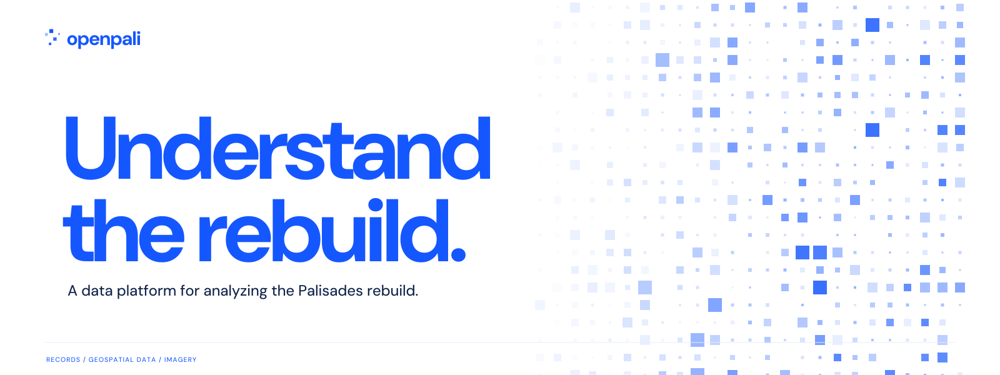

# OpenPali brand kit

**Understand the rebuild.**

The current **Signal** identity uses scattered cobalt squares on white, large direct typography, and a single primary GitHub action. It introduces OpenPali as a platform that brings siloed records, geospatial data, and imagery together for rebuild analysis.



## Current assets

The active artwork lives in [`assets/brand/signal/`](../../assets/brand/signal/).

| Asset | Size | Use |
| --- | --- | --- |
| [README banner](../../assets/brand/signal/banner.png) / [SVG](../../assets/brand/signal/banner.svg) | 1600 × 600 | Repository introduction. |
| [Social preview](../../assets/brand/signal/social-card.png) / [SVG](../../assets/brand/signal/social-card.svg) | 1280 × 640 | GitHub and Open Graph preview. |
| [Avatar PNG](../../assets/brand/signal/avatar.png) / [SVG](../../assets/brand/signal/avatar.svg) | 512 × 512 | Dedicated project account artwork. |
| [Favicon](../../assets/brand/signal/favicon.svg) / [PNG](../../assets/brand/signal/favicon.png) | 32 × 32 | Browser icon. |
| [Square field](../../assets/brand/signal/field.svg) / [placement data](../../assets/brand/signal/field.json) | 800 × 900 | Website background and future compositions. |
| [ASCII companion](../../assets/brand/signal/openpali.txt) | Plain text | Terminal or text-only project introduction. |

The squares have fixed, independent positions and varied size and opacity. Keep their arrangement open and scattered; do not assemble them into a P. They are decorative, so their number, color, and position do not represent records, coverage, progress, or measurements.

## Color and type

| Token | Value | Role |
| --- | --- | --- |
| White | `#FFFFFF` | Page and asset background. |
| Cobalt | `#1557FF` | Headline, squares, and primary action. |
| Ink | `#10234A` | Dark text. |

Use **DM Sans** for display and interface text. The [local font](../../assets/brand/fonts/DMSans.woff2) ships with its [SIL Open Font License notice](../../assets/brand/fonts/DMSans-OFL.txt). Preserve that notice when redistributing the font. Exported asset lettering is outlined; the website retains selectable HTML text.

Give the headline and explanation room to breathe. Keep dense square clusters clear of essential text, preserve the white background, and use the same small scattered-square identity across the website, repository, and social assets.

## Voice

| Purpose | Copy |
| --- | --- |
| Headline | Understand the rebuild. |
| Explanation | OpenPali brings siloed public records, geospatial data, and imagery into one platform for analyzing the Palisades rebuild. |
| Compact description | A data platform for analyzing the Palisades rebuild. |
| Eyebrow | DATA INTEGRATION / REBUILD ANALYSIS |
| Primary action | View on GitHub |

Lead with what people can do: connect sources, explore properties and timelines, and analyze rebuild activity. Name the actual analysis when space permits: milestones, permit flow, backlog, or time to issuance. Source lineage supports that work.

Scope claims to the implementation. The local map uses a bundled snapshot; release analytics require the platform services. Imagery, terrain, and 3D assets have specific coverage, dates, and rights. Avoid claims of live monitoring, complete coverage, production photo/video fusion, or approved AI forecasts. Use the [project overview](../../README.md#connect-explore-analyze) for the current capability summary.

## Motion and production

The website uses a decorative inline SVG. On devices with a fine pointer, nearby squares gently increase in size and opacity around the pointer while their centers stay fixed. The field stays still for touch and reduced-motion preferences. There is no autonomous animation loop, and the artwork conveys no information required to use the page.

[`generate-assets.py`](../../assets/brand/signal/generate-assets.py) creates the deterministic square field, outlined SVG compositions, and ASCII companion. It requires FontTools with WOFF2 support. [`export-assets.cjs`](../../assets/brand/signal/export-assets.cjs) exports PNGs using Sharp. These are asset-authoring dependencies; the website build uses Python's standard library.

```sh
python3 assets/brand/signal/generate-assets.py
node assets/brand/signal/export-assets.cjs
python3 scripts/build-site.py
```

After changing assets, check the banner at GitHub content width, the social card as a thumbnail, and the icon at 16 and 32 pixels. See the [website guide](../../site/README.md) for local preview and deployment details, and the [launch kit](LAUNCH.md) for publication copy and repository settings.

The current square artwork is generated from the committed code and placement seed. This guide grants no software, asset, or trademark license. Follow the repository's [licensing notice](../../README.md#license-and-data-rights).

## Design history

Earlier directions remain available as historical explorations. They are not the active marketing identity.

- [Original studies and review](../../design-lab/README.md), including the first Signal experiment.
- [Round-two studies](../../design-lab/round-2/README.md) and the [archived Field Office guide](FIELD-OFFICE.md).
- [Round-three studies](../../design-lab/round-3/README.md) and the [archived Field Notes website](../../design-lab/round-3/field-notes/).
- [Original reference research](REFERENCES.md).
