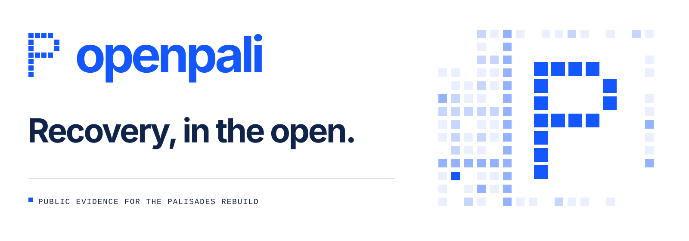

# OpenPali brand kit

**Recovery, in the open.**

OpenPali's identity combines a clear public purpose with the pleasure of building together. The Parcel P is made from fifteen squares on a five-column, seven-row grid. Small contributions form something recognizable.



## Use the right asset

| Asset | Size | Use |
| --- | --- | --- |
| [Blue mark](../../assets/brand/mark.svg) / [white mark](../../assets/brand/mark-white.svg) | 256 × 256 | Transparent vector mark for light / dark surfaces. |
| [Blue wordmark](../../assets/brand/wordmark.svg) / [white wordmark](../../assets/brand/wordmark-white.svg) | 640 × 128 | Transparent horizontal identity. |
| [Avatar](../../assets/brand/avatar.png) | 512 × 512 | A dedicated project account or community space. Do not replace a person's avatar with it by default. |
| [README banner](../../assets/brand/banner.svg) | 1600 × 560 | Repository hero, with an explicit white background for both GitHub themes. |
| [Social preview](../../assets/brand/social-card.png) | 1280 × 640 | GitHub social preview, Open Graph, and landscape announcements. |
| [Social square](../../assets/brand/social-square.png) | 1080 × 1080 | Square announcement artwork. |
| [Favicon](../../assets/brand/favicon.svg) | 16 × 16 | A solid, simplified P for small browser icons. |
| [ASCII mark](../../assets/brand/openpali.txt) | Plain text | Terminal welcomes, release notes, and developer posts. |

Editable SVG versions and transparent PNG exports are together in [`assets/brand/`](../../assets/brand/). [manifest.json](../../assets/brand/manifest.json) records vector dimensions and the mark's grid.

## Palette

| Token | Hex | Role |
| --- | --- | --- |
| Pali blue | `#1557FF` | Identity, primary action, and emphasis. |
| Ink | `#10234A` | Main text. |
| White | `#FFFFFF` | Canvas and reversed mark. |
| Pale blue | `#EAF0FF` | Decorative square fields. |
| Mid blue | `#C6D6FF` | Decorative supporting cells. |
| Soft blue | `#94B2FF` | Decorative accents. |

The website uses `#5A6B85` for readable secondary text. Pale colors are for artwork and borders, not essential text. These are brand colors; product evidence lanes keep their own semantics.

## Shape, spacing, and type

- Keep the mark's square cells and gaps proportional. Leave at least one cell of clear space around it.
- Use the full Parcel P at larger sizes; use the solid favicon at 16–32 pixels.
- Use blue on white or white on blue/ink. Preserve transparent backgrounds when a mark is placed on a surface.
- The designed wordmark is lowercase **openpali**. Write **OpenPali** in prose.
- Use a system sans-serif for headings and text, with system monospace for code and small labels. No paid or downloaded font is required.
- Keep the white banner background: its artwork and typography are designed to remain legible in GitHub's light and dark themes.
- Square fields are abstract. Never use their color or density to imply the number of homes rebuilt, a person's progress, or a measure of evidence quality.

## Voice

**Public description:** A public evidence platform for the Palisades rebuild.

**Public headline:** Recovery, in the open.

**Developer invitation:** Build in the open.

**Community invitation:** Bring your square.

Use specific, readable language. Celebrate a useful fix and the person who made it. Keep recovery records calm and factual. Do not invent growth statistics, endorsements, or claims of complete coverage. Say “no public evidence” when that is what the system knows.

## Reproduce the assets

The editable vector and ASCII sources need only Python:

```sh
python3 scripts/generate-brand.py
```

Raster exports use Sharp. Install the optional export dependency in a temporary
directory so it does not alter the map application's dependencies:

```sh
npm install --prefix /tmp/openpali-brand-tools sharp
NODE_PATH=/tmp/openpali-brand-tools/node_modules node scripts/export-brand.cjs
```

The script writes PNGs next to the SVG sources. Inspect the results after any
typography change. System fonts may vary across operating systems, so commit
the reviewed exports along with their source. The website build uses committed
PNGs and does not install Sharp.

The website's square field is a separate composition in `site/index.html`, with the same mark matrix. Regenerating the brand kit does not rewrite the website.

## Rights and attribution

This artwork was created for OpenPali. Reference projects inspired the presentation approach; their marks, images, and copy are not included. This guide does not grant a trademark or asset license. Follow the repository's [current licensing notice](../../README.md#license-and-data-rights). Third-party source data and map assets have separate terms.

## Launch materials

- [Research and reference study](REFERENCES.md)
- [Implementation plan and completion checklist](PLAN.md)
- [Launch copy and repository settings](LAUNCH.md)
