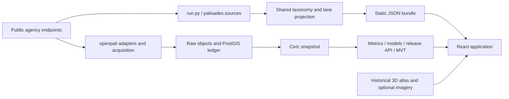

# OpenPali: CTO discovery audit

September 24, 2026 · RE\SPRING · repository baseline `e3201b9`

Follow-up: [verified data expansion](2026-09-24-DATA-EXPANSION.md) documents
subsequent acquisitions and corrects initial availability conclusions. Original
bundle/architecture findings below describe the inspected baseline; the later
source collections are staged locally and do not represent a deployed refresh.

## Assessment

OpenPali has a useful evidence model and substantial infrastructure, but the
repository does not establish a reliable, current picture of physical recovery.
The largest immediate gains come from consistent releases, better observation
coverage, dated imagery, and a real transaction history. More sophisticated
models become useful after those foundations produce measurable targets.

The initial 0–100 scoring function is no longer called by the static producer.
The current map uses documented milestone flags. “Lanes” are five parallel
categories of public evidence: cleanup, design review, permitting, construction,
and occupancy. This separation is useful; the maximum milestone color hides
much of it. A missing record cannot establish an empty lot, an inactive project,
or an owner's intention. A permit or CofO may describe one building or project
within a parcel, rather than the entire property's recovery.

**Recommended direction:** retain React/Vite, MapLibre, Python, PostGIS, and
object storage; finish their data contracts; adopt COSS for the interface;
build independently testable agency, site-observation, and market histories.
Use machine learning for specific, validated questions. Neither the existing
timing model nor the 3D demonstration establishes state-of-the-art performance.

Companion documents:

- [Source inventory, exact field uses, access findings](2026-09-24-SOURCE-INVENTORY.md)
- [Implementation sequence and research program](../Plans/2026-09-24-RECOVERY-INTELLIGENCE.md)
- [Machine-readable bundle census](2026-09-24-bundle-audit.json)
- [Live civic probes](2026-09-24-source-probes.json), [sales probes](2026-09-24-assessor-probe.json), [evaluation counterexamples](2026-09-24-methods-probe.json)

## What was actually examined

Read the static and canonical acquisition paths, normalization, taxonomy,
projection, ledger, snapshots, publication/API, metrics, training/evaluation,
orchestration, spatial pipelines, frontend data loading and rendering. Profiled
the complete bundled parcel/detail/summary/coverage artifacts. Probed all seven
configured civic adapters using metadata, vocabulary and aggregate queries.
Examined selected CVP identity, map, imagery, and research-workflow contracts
and implementations at commit `d5be08e2ae600ce392ee0243beb69002269a29be`.
Consulted primary agency, vendor, COSS, TorchGeo, and methods sources.

This is a repository and bounded-source audit. Production infrastructure,
credentials, scheduler state, and deployed release contents were not verified.
The local API was unavailable; browser inspection exercised the static fallback.
No public dataset was refreshed or published, and no commercial imagery or
market data was ordered. Existing infrastructure drill reports are historical
evidence, not newly executed production certification.

## Two serving paths still coexist



[`pipeline/run.py`](../../pipeline/run.py) still produces the static bundle.
[`palisades/sources.py`](../../pipeline/palisades/sources.py) now uses the shared
evidence semantics. [`score.py`](../../pipeline/palisades/score.py) remains as
historical code, with tests; it does not drive that producer.

[`App.tsx`](../../web/src/App.tsx) always loads static geometry, summary, and
details. It independently probes the API through the post-fire spatial helper,
then overlays release totals on static summary fields. The map can use API
vector tiles while search, neighborhood statistics and selected properties
still use the static parcel set. The property card combines API evidence with
static permits. A release badge therefore does not prove consistent content.

The static files themselves are internally consistent in this checkout:
all four declared snapshot IDs match, all three declared artifact hashes match,
and published milestone totals reconcile exactly. The browser does not enforce
those checks, and `coverage.json` is outside that three-artifact manifest.

## The current evidence census

The bundled release is **July 12, 2026: 74 days old** on the audit date.
Its universe is **5,877 destroyed parcels**, selected from the County debris
program. It is not every affected structure, home, household, or nearby property.
All parcel polygons passed Shapely validity checks. There were no duplicate
APNs, missing parcel details, or duplicate observation IDs.

| Evidence on a parcel | Bundled count | Interpretation |
|---|---:|---|
| Cleanup completed | 3,964 | Documented completion, largely government-program sign-off |
| Private cleanup opt-out | 1,595 | Program choice; does not establish remaining debris |
| Application submitted | 1,205 | At least one qualifying application |
| Plans approved | 878 | At least one qualifying approval |
| Permit issued | 965 | At least one qualifying issued permit |
| Construction evidence milestone | 1 | County coarse completion; city inspection outcomes absent |
| Construction inspection scheduled only | 436 | Activity scheduled, not work completed |
| CofO issued | 27 | A qualifying certificate in records; household return unknown |
| No evidenced milestone | 1,371 | Includes evidence gaps; not a count of untouched lots |

These categories overlap and must not be added into a recovery total. In
particular, 27 occupancy certificates alongside one construction milestone
exposes unequal source coverage, rather than a physical impossibility.

| Jurisdiction | Parcels | Cleanup | Permit issued | Construction milestone | CofO |
|---|---:|---:|---:|---:|---:|
| City of Los Angeles | 4,701 | 3,103 | 790 | 0 | 27 |
| Unincorporated County | 553 | 434 | 90 | 1 | 0 |
| Malibu | 623 | 427 | 85 | 0 | 0 |

Different jurisdictions have different observation systems. Comparing their
raw milestone percentages as rebuilding speed would confound progress with
coverage. The same applies to neighborhood comparisons.

There are 19,916 observations, all first observed on July 12. Of these, 10,969
have exact event dates, 5,877 have intervals, and 3,070 have unknown dates.
The 5,877 destruction intervals lack an upper bound in the bundle even though
the current normalizer has a bounded interpretation. One non-scheduled exact
date is later than its observation date; it needs source adjudication.

All bundled observation references lack a per-record payload hash. Source-level
hashes exist in metadata, so this is a limitation of record-level replay from
the bundle, not proof that no raw bytes were retained elsewhere. The canonical
ledger has richer provenance machinery. The static inspection source is named
`inspections` in metadata and `ladbs_inspections` in observations.

There are 5,033 permit records on 1,714 parcels. **Every valuation is null.**
No listings, ownership-transfer series, sale prices, insurance series or market
model are currently ingested. Pre-fire building attributes exist but describe
the former property, not replacement construction.

### What the live probes changed in our understanding

- County still returns 5,877 parcels under the same filter. It now includes
  **82 `Rebuild In Construction` records**, an unknown taxonomy value before
  this audit's patch.
- LADBS recovery permits now returns 6,485 rows versus 5,331 in the bundle,
  a 21.6% increase in source records. That is not 1,154 additional homes or
  completed projects; qualification and APN joins must be rerun.
- The canonical inspection endpoint returns 1,024 rows, all `Insp Scheduled`.
  A refresh of this endpoint alone cannot produce passed inspection outcomes.
- DINS returns 12,137 structure assessments, including 6,845 destroyed and
  4,261 with no damage. It is implemented in the canonical path but absent
  from the static observation bundle.
- A public Assessor layer exposes sale dates/prices, but its newest sale in
  the study rectangle is May 10, 2024. It has **zero post-fire sales**. An
  accessible schema is insufficient evidence of a useful current market feed.

Exact endpoints, filters, counts and limitations are in the source inventory.

## Engineering findings, ordered by consequence

These findings are established by code inspection unless explicitly described
as reproduced. The two small fixes below are separate from this open backlog.

| Priority | Finding and location | Consequence | Required acceptance check |
|---|---|---|---|
| P0 | [`releases.py`](../../pipeline/openpali/api/routers/releases.py): detail and MVT read `ParcelVersion.observed_to IS NULL`; bbox search considers parcel versions without snapshot membership | An old immutable release can change geometry, center or pre-fire attributes after new ingestion | Publish A, revise a parcel in B, prove A detail, tiles, bbox results and hashes remain identical; join stored parcel-version snapshot members |
| P0 | [`App.tsx`](../../web/src/App.tsx), [`apiDetail.ts`](../../web/src/lib/apiDetail.ts), [`postfire.ts`](../../web/src/lib/postfire.ts): independent API/static resolution and partial overlays | Counts, geometry, search and evidence can describe different releases; an outage can be cached; observation fetching silently stops on failure or after 600 rows | One release context; complete compatible fallback; mismatch/outage/partial-pagination tests |
| P0 | [`load.py`](../../pipeline/openpali/ingestion/load.py), [`snapshot.py`](../../pipeline/openpali/ingestion/snapshot.py): append-only derived assertions, source-wide historical selection; case links use conflict-do-nothing | Corrected issue dates, rebuild flags or APNs can leave earlier assertions active without an explicit revision; selected acquisition runs do not precisely select the source-record universe | Changed/removed record fixtures, explicit supersession and withdrawals, deterministic replay of the exact selected versions |
| P0 for forecasts | [`experiments.py`](../../pipeline/openpali/ml/experiments.py), [`dataset.py`](../../pipeline/openpali/ml/dataset.py): unsupported evaluation horizons and retrospective labels | Apparent model quality can exceed what the available follow-up establishes | Censoring support and outcome-maturity gates; historical-origin replay; counterexamples must return unavailable metrics |
| P1 | [`flows.py`](../../pipeline/openpali/orchestration/flows.py): failure converted to `RuntimeError`, but retry predicate recognizes `AcquisitionError`; failure raised inside transactional session | Intended transient retries do not match the raised type; failure audit rows can roll back | Execute transient/permanent/unknown-domain failures; verify retry class and durable failure records |
| P1 | [`release.py`](../../pipeline/openpali/publication/release.py): `required_sources` checks supplied sources, not an independently required set; nonempty universe is a weak completeness gate | Missing source or truncated acquisition may pass some direct publication paths | Mandatory source set, completed pagination, count drift, join coverage and freshness gates at publication boundary |
| P1 | [`deploy.py`](../../pipeline/openpali/orchestration/deploy.py) registers flows without a schedule | Deployment definitions alone do not establish continuous refresh | Verify the deployed schedule, execution history, freshness alerts and last successful acquisition per source |
| P1 | [`experiments.py`](../../pipeline/openpali/ml/experiments.py): experiment ID excludes code commit; upsert replaces metrics without replacing artifact/code fields | A rerun can associate new metrics with old artifact metadata | Immutable attempt IDs incorporating code/config/data; no overwrite of an evaluated run |
| P1 | [`neighborhoods.py`](../../pipeline/palisades/neighborhoods.py): nearest configured center | Named neighborhood results do not use validated neighborhood boundaries | Versioned polygon definitions and explicit boundary uncertainty; distance/adjacency analyses independently computed |
| P1 | Imagery URLs, fallback and 3D coverage metadata | Processing/publication dates can be mistaken for capture; historical or synthetic geometry can imply current observation | Per-asset capture provenance, visible fallback, synthetic-source labels, release-qualified assets |

The model registry's reviewer field is a string, not evidence of an independent
review workflow. Cohort gates can lack eligible cohorts. Existing fixture-domain
compatibility checks are useful and should be preserved. None of these findings
establishes that an invalid model is currently served in production.

## Why the model evidence is insufficient

The current ladder is a complete-case naive baseline, Kaplan–Meier, and Cox
proportional hazards with one feature: submission days since the fire.
The retained synthetic drill exercises orchestration and model lifecycle; its
320-row proportional-hazards fixture is not evidence of real Palisades accuracy.

The final holdout selects applications from the last 60 days while the main
target is issuance within 180 days. Administrative censoring removes the mature
non-event outcomes needed to validate that target in this cohort. Training
durations are derived at the full snapshot cutoff, rather than recensored at
each historical training origin. The development run trains on the first two
blocks and evaluates on the third; it is not a full rolling replay.

Reproducing the existing helpers gave:

| Synthetic 180-day case | Existing result | Problem |
|---|---|---|
| 100 applications censored at day 30, predicted issuance probability 0.99 | Brier 0.0, evaluable 0, floor hits 0 | A perfect-looking numeric score with no observable horizon outcomes |
| 30 issuances at day 10, 70 censored at day 40, probability 1.0 for everyone | Brier 0.0; two calibration bins each report predicted 1.0 / observed 1.0 | Early-censored cases disappear from calibration; there is no full-cohort support at 180 days |

This does not refute censoring-aware scoring. It shows why support, censoring
assumptions and evaluation design must be checked before computing or promoting
a number. The current floor counter does not catch these examples.
[Scikit-survival's evaluation guidance](https://scikit-survival.readthedocs.io/en/stable/user_guide/evaluating-survival-models.html)
describes the need for a supported time range; research on
[administrative censoring and Brier scores](https://arxiv.org/abs/1912.08581)
explains additional problems with administrative censoring.

## Spatial and interface assessment

The custom WebGL implementation contains real geodesy, tiling, culling and
registration work. Its present data contributes little evidence about *new*
construction. The USGS asset is a January 21, 2025 bare-earth DEM. The old
LARIAC atlas contains 4,976 models plus 901 synthetic fallback geometries.
It is approximately 409 MiB on disk and still reports score-tinted splats.
These assets need truthful vintage/type labels and compatible release handling.

The “Alphabets / Village” summary assigns 2,043 parcels using nearest-center
grouping. The four-tile USGS area and this named grouping are different spatial
definitions. Neither establishes a validated comparison of neighborhood
recovery speed. Valid parcel geometry alone does not validate neighborhood
membership, building-to-project links, imagery registration or map picking.

The frontend consistently uses React, TypeScript and Vite. The inconsistency
is mainly in component patterns, data loading and visual language. COSS can
be adopted within this stack. The useful product should let a resident inspect
a claim and its date, an analyst compare coverage-aware neighborhoods, and an
operator diagnose stale sources without exposing engineering terminology in
ordinary property flows.

Raw startup data currently includes a 6.5 MB parcel file and a 20.9 MB details
file, before compression. Loading all details after first paint still imposes
network, parse and memory costs. Release-qualified tiles plus bounded search
and on-demand property hydration should replace that requirement. 3D remains
an optional contextual view until it demonstrates additional decision value.

## Changes completed during this audit

1. Added a reproducible, read-only bundle profiler and civic source probe script,
   with checked-in audit outputs. The profiler verifies rather than rewrites
   bundled artifacts.
2. Added the newly observed County construction status to taxonomy v2 and lane
   policy v2. It yields **agency-reported construction in progress**, with an
   unknown occurrence date, without claiming inspection passage, completion or
   CofO. Three regression tests cover this distinction and unknown-value handling.
   The static bundle is still v1; no ledger migration or public refresh occurred.
   A v2 replay must resolve supersession and audit changes before publication.
3. Corrected map initialization to use zero pitch in 2D. It previously opened
   at 62 degrees despite its 2D state. Verified the corrected flat view and APN
   search/property navigation in Chrome against the local static app.
4. Corrected README claims that the static path was retired and that all
   displayed fields were already guaranteed to share one release.

## Verification and reproduction

The final fast gate passes: **163 Python tests passed, 16 skipped; 24 frontend
tests passed; lint, typecheck and OpenAPI drift passed**. The production frontend
build also passes (1.30 MB main JS, 360 KB gzip; existing chunk-size warning).
Logs are under `data/out/checks/fast-20260925T010927Z-*` locally. Full service,
integration, GPU/spatial and end-to-end release gates were not rerun; skipped
integration tests must not be counted as production assurance.

Run from the repository root after installing the pinned pipeline environment:

```sh
pipeline/.venv/bin/python scripts/audit_data.py --as-of 2026-09-24 --output /tmp/openpali-bundle-audit.json
pipeline/.venv/bin/python scripts/probe_sources.py --output /tmp/openpali-source-probes.json
sh scripts/check-fast
npm --prefix web run build
```

The first command is offline. The second contacts public endpoints and will
produce a newly dated result, not necessarily the September counts. Raw source
responses must be acquired through the canonical pipeline when building a
replayable application release; these aggregate probes do not replace ingestion.
