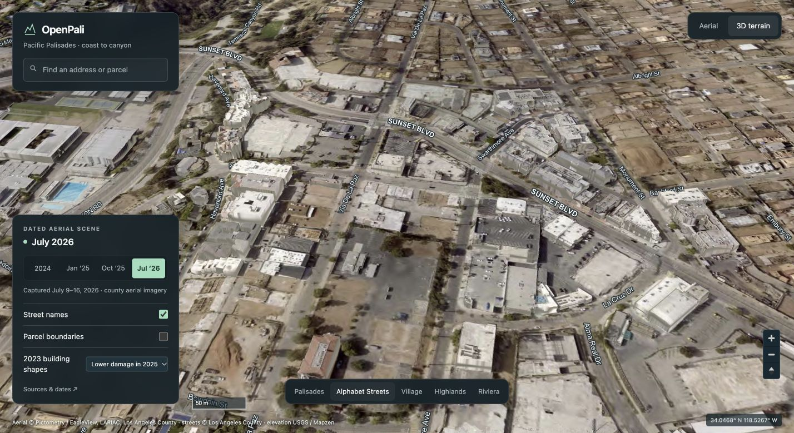
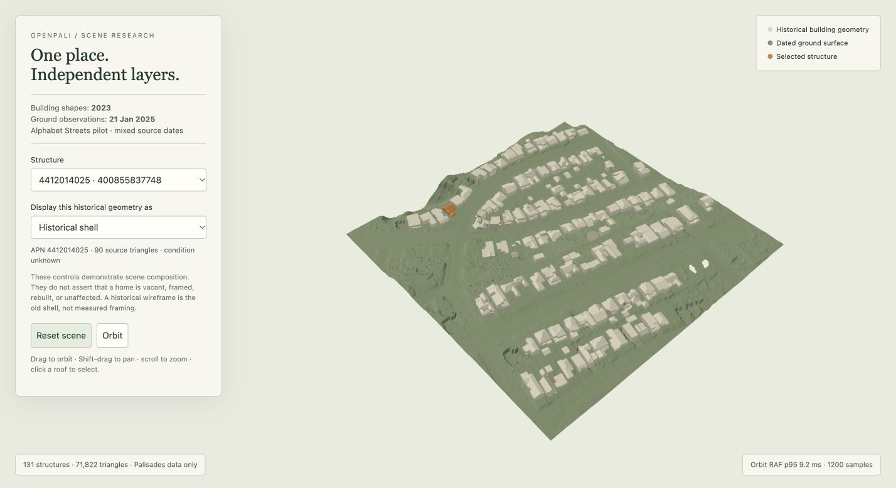

# A Palisades scene we can control

The first target is **smooth navigation through the best available dated scene**. We should own the rules that turn source geometry and dated evidence into visible objects. The regional scene can contain terrain, roads, vegetation, historical buildings, observed replacement structures, and parcel evidence, with separate controls for each.

I recommend a compiler that produces a bounded regional scene with individually addressable structures. Keep geometry, physical-condition evidence, and display choices separate. A verified vacant property removes a building representation while retaining the terrain beneath it. A new observation can replace one structure without regenerating the neighborhood.

This note narrows the [systems design space](2026-09-29-SYSTEMS-DESIGN-SPACE.md) to that goal. [Measurements](2026-09-29-scene-measurements.json) distinguish source metadata, local measurements, and proposals. The [prototype compiler](experiments/palisades_scene/build_scene.py) and [preview template](experiments/palisades_scene/preview.html) are isolated research code. The current application has not been replaced.

## Visual correction: a continuous dated aerial scene

The first preview missed the visual target. Its untextured shells and small terrain patch tested geometry composition but did not deliver a recognizable Palisades scene. When started with the command below, the corrected preview at **http://127.0.0.1:8941/** opens with continuous regional aerial coverage, coastal and canyon context, street names, parcel search, and camera controls. The earlier geometry benchmark remains available as `geometry-probe.html`.



The county's published source metadata reports these capture ranges, and actual image tiles were retrieved and inspected:

| Layer | County-reported capture | Primary source |
|---|---|---|
| Summer 2024 | May 26–July 3, 2024 | [County imagery metadata](https://rpgis.isd.lacounty.gov/Geocortex/Essentials/REST/sites/GISNET_Public/map/mapservices/80?f=json) |
| January 2025 | January 18, 2025 | [County imagery metadata](https://rpgis.isd.lacounty.gov/Geocortex/Essentials/REST/sites/GISNET_Public/map/mapservices/74?f=json) |
| October 2025 | October 27–28, 2025 | [County imagery metadata](https://rpgis.isd.lacounty.gov/Geocortex/Essentials/REST/sites/GISNET_Public/map/mapservices/78?f=json) |
| July 2026 | July 9–16, 2026 | [County imagery metadata](https://rpgis.isd.lacounty.gov/Geocortex/Essentials/REST/sites/GISNET_Public/map/mapservices/81?f=json) |

These ranges identify the source campaigns. We have not independently measured each image's capture time. Newer imagery is displayed without an older-image fallback underneath it.

The new [regional compiler](experiments/palisades_scene/build_regional_buildings.py) retains **10,368 historical structures**, **1,016,500 triangles**, and **78 geometry batches** inside a declared study rectangle. Their indexed vertex/index buffers total **31,860,624 bytes**. The native [WebGL layer](experiments/palisades_scene/building_layer.js) loads visible batches, projects dated aerial textures onto roofs, and keeps per-structure display choices in a separate integer texture. Outline indices are prepared when a batch loads. A subsequent representation edit changes one state byte. MapLibre provides camera, raster streaming, terrain rendering and street labels; it does not determine physical conditions.

The default view presents the July 2026 aerial imagery. The optional historical roof layer can filter to the source's `No Damage`, `Affected (1–9%)`, and `Minor (10–25%)` assessments from the 2025 fire. That filter retains **3,726 shapes** and excludes destroyed, major-damage and unassessed shapes. It is a dated damage filter, rather than a new survey of rebuilding. Roof colors come from aerial projection; façade photographs, newly observed framing geometry, and replacement-building geometry remain missing.

Four downloaded **0.5 m USGS DEMs**, acquired January 21, 2025, supply terrain in the frozen 1.5 × 1.5 km Alphabet Streets pilot. Mapzen supplies regional terrain context outside it. The [local server](experiments/palisades_scene/serve_map.py) samples the metric DEMs into Terrarium tiles, preserves internal source-tile edges, and blends the outer pilot boundary over 25 metres. This source resolution is separate from the renderer's camera-dependent mesh resolution. Native roof heights are converted from EGM96 to NAVD88/GEOID18 for the pilot; regional elevation registration has not been independently verified.

The [regional verifier](experiments/palisades_scene/verify_regional_map.py) passed finite-value, buffer-hash, index-range, feature-identity and UV checks. [Recorded results](2026-09-29-regional-scene-checks.json) include one encoded terrain pixel that differed from its sampled source height by **0.00152 m**, within Terrarium quantization. This checks encoding and sampling, not survey accuracy. [Browser checks](2026-09-29-regional-browser-checks.json) confirmed all four date switches and parcel search. For APN 4412013017, shell → outline → hidden changed one state byte per edit; geometry uploads stayed at 39 and uploaded geometry stayed at 10,091,412 bytes. No errors were reported in that check. The earlier RAF benchmark below applies only to the original geometry probe; it is not a regional performance measurement.

To run the corrected visual experiment with the same Draco package and PROJ grids used below:

```sh
pipeline/.venv/bin/python Docs/Research/experiments/palisades_scene/build_regional_buildings.py --draco-module /tmp/openpali-scene-probe/node_modules/draco3d --grids /tmp/openpali-scene-probe/proj-grids
pipeline/.venv/bin/python Docs/Research/experiments/palisades_scene/prepare_map.py
pipeline/.venv/bin/python Docs/Research/experiments/palisades_scene/verify_regional_map.py
pipeline/.venv/bin/python Docs/Research/experiments/palisades_scene/serve_map.py --port 8941
```

The preparation script uses the current local parcel release and installed MapLibre distribution. It downloads the four declared USGS terrain rasters and county source metadata. Generated assets and caches stay in `data/`; the application source and dependencies are unchanged.

## The original geometry experiment

The archived [standalone geometry probe](../../data/out/scene-prototype/geometry-probe.html) uses real county building triangles and the archived USGS LiDAR tile. It has orbit, pan, zoom, roof picking, structure selection, and three representations: historical shell, historical wireframe, and hidden building with retained terrain.



The pilot covers approximately **358 × 343 metres** in the Alphabet Streets. It contains **131 structures across 99 APNs**, **11,067 building triangles**, and **60,755 terrain triangles**. It is a demonstration of independently controlled layers. Every structure's physical condition remains `unknown`. A historical wireframe is an old building shell, not observed framing.

The compiler retrieves one building geometry node and bounded metadata/attribute resources: approximately **153 KB** of decompressed responses in this run. It uses the already archived **83.6 MB** LiDAR file. It scans that file's **20,118,164 points**, retaining approximately **2.12 million classified-ground points** inside the pilot. The terrain preview uses a **2 m grid**, cell medians, and nearest supported-cell fill up to **3 m**. Unsupported cells produce holes. This is deliberately a modest terrain approximation for the composition experiment; it does not establish the target scene's final resolution.

Local browser measurements:

| Measurement | Actual result | Interpretation |
|---|---:|---|
| Renderer | ANGLE Metal, Apple M4 Pro | Actual hardware renderer reported by the connected Chrome context |
| Drawing buffer | 2856 × 1558, device pixel ratio 2 | This viewport only |
| Active orbit intervals | 1,200 samples | One run; first 1,200 active RAF intervals retained |
| Median / p95 RAF interval | 8.3 / 9.2 ms | Animation scheduling cadence; GPU timestamps and presented-frame timing were not measured |
| p95 CPU command submission | 0.4 ms | Excludes asynchronous GPU execution |
| Representation update | 1 byte per edited structure | Payload sent with `texSubImage2D`; driver and event overhead are additional |
| Geometry uploads before / after two edits | 2 / 2 | Building and terrain buffers remained uploaded; their geometry hash stayed unchanged |
| Resident vertex buffers | 8,618,640 bytes | Prototype expands existing triangles for flat normals and derivative wireframes; production can use indexed meshes |
| Maximum added float32 position displacement | 0.0000108 m | Encoding error relative to decoded, transformed vertices; **not source or surveying accuracy** |

The browser uses simple shading. These results do not cover imagery, shadows, vegetation, higher-resolution captures, network streaming, levels of detail, the entire Palisades, or mobile hardware. Hiding a building currently discards fragments; its vertices are still submitted. Draw-list or cluster culling could additionally remove that work.

An independent check against the portable release found **all 131 APNs**, with **127 mesh-average positions inside their associated parcels**. Four positions were outside; the largest distance was **7.40 m**. These require inspection of source association, overhang/geometry extent, centroid definition, and parcel versions. The check diagnoses a relationship; it is not an independent survey. See the [reproducible verifier](experiments/palisades_scene/verify_scene.py).

## What the actual source paths tell us

1. **Current map:** [Map.tsx](../../web/src/Map.tsx) draws raster basemap tiles plus flat parcel fills. It colors an agency `stage`. It does not currently render building meshes or terrain.
2. **Historical buildings:** [scene_client.py](../../pipeline/core/spatial/scene_client.py) already knows the county I3S service and APN attributes. Its extraction path decodes meshes, samples faces into surfels, converts coordinates, and constructs `GaussianBatch` objects. For roof shells, retaining the original triangles removes the surface-sampling step and avoids introducing sampling holes or splat overlap.
3. **Identity loss:** [schema.py](../../pipeline/core/spatial/schema.py) can retain APNs in Gaussian arrays, but [splat_tiler.py](../../pipeline/core/spatial/splat_tiler.py) packs a 32-byte splat without per-point APN or acquisition time. Bounding-box picking is not the same as an object identifier on every render primitive. A representation that merges structures cannot reliably hide one home later.
4. **Terrain:** [derive.py](../../pipeline/openpali/spatial/derive.py) already has metric DEM processing and vertical-frame reconciliation. The frozen [AOI](../../pipeline/openpali/spatial/palisades_aoi.geojson) covers an Alphabet Streets pilot, rather than defining the whole Palisades.
5. **Evidence:** [intelligence/build.py](../../pipeline/openpali/intelligence/build.py) already builds content-addressed, source-linked releases. Agency stages and cleanup records are useful inputs, but do not determine the exact geometry of a structure or whether the lot is presently vacant.

The county [item metadata](https://www.arcgis.com/home/item.html?id=d4018709bc26465daf33abe15b25d1e9) describes **2023 building geometry**, reprocessed in **September 2026**. That is source-reported vintage, not a newly measured 2026 condition. Its description also says the models are non-authoritative. The archived terrain acquisition is **21 January 2025**, supported by the project's existing visual acquisition report. The prototype therefore presents a dated mosaic, rather than a scene observed on one common day.

A live source probe found another practical issue: the sampled node's uncompressed buffer `0` returned an ArcGIS resource error, while Draco buffer `1` was available. The existing client assumes a fixed uncompressed layout. The new experiment follows `geometryDefinitions`, uses the official Draco decoder, reads the position scale metadata, and retains `feature-index` values and their feature IDs. The [I3S compressed-attribute specification](https://github.com/Esri/i3s-spec/blob/6cfdef9024ca1abc6c9f3b408ce941abfe287f0e/docs/1.7/compressedAttributes.cmn.md) explains these fields. The inspected [loaders.gl parser](https://github.com/visgl/loaders.gl/blob/d18246f4ef6382f787a6ae2e9e21d8a7f40e5917/modules/i3s/src/lib/parsers/parse-i3s-tile-content.ts) applies `i3s-scale_x/y`, restores feature metadata, and converts local positions.

That is a useful adapter boundary: county encodings can change while the scene's structure and visibility rules stay stable.

## The concepts that expand our options

**A scene graph is a set of objects with separate identities and transforms.** One APN can contain a house, garage, and accessory dwelling. The pilot's 131 structures on 99 parcels makes this concrete. Give each structure and geometry version an identity, then relate it to a parcel and a project. Retain both source feature IDs and building IDs. Source feature IDs may change when a service is republished; persistent structure identity needs a separate registry and explicit matching/replacement decisions.

**A bare-earth terrain model differs from a surface model.** A terrain model approximates the ground; a surface model can include roofs and trees. Draping imagery over a surface model and then hiding a separate roof mesh leaves another roof-shaped surface behind. Here we use LAS class 2 for dated ground support and keep the building layer independent. Retaining-wall faces, overhangs, bridges, and thin construction members may need ordinary 3D meshes beyond a single-height terrain grid.

**Geometry and its material both need semantic control.** Hiding a roof does not erase its photograph from historical aerial imagery. For a cleared lot, use dated roof-free imagery when available, or an explicit neutral lot material. A generated or inpainted texture would be a visualization choice, not an observation. Masks must also affect shadows, depth, picking, and coarser geometry.

**A feature table is GPU indirection.** The mesh carries a small integer. The shader looks up that integer in a table of display choices. In this experiment, changing a structure from shell to hidden changes one table byte. The geometry stays in GPU memory. Feature IDs and metadata already have standardized forms in [3D Tiles 1.1](https://docs.ogc.org/cs/22-025r4/22-025r4.pdf); this basic mechanism is established prior art.

**Level of detail and construction stage are different dimensions.** Level of detail chooses an approximation based on the camera and an error budget. Construction stage describes dated physical evidence. A distant vacant lot must remain vacant; a coarse neighborhood mesh must not reintroduce a roof hidden in the detailed mesh. [Progressive meshes](https://hhoppe.com/pm.pdf) provide a foundation for refinement and transitions. The inspected [meshoptimizer simplifier](https://github.com/zeux/meshoptimizer/blob/4c203430ca565cb59a468a91922c76c208169536/src/simplifier.cpp) classifies borders/seams, accepts vertex locks and appearance attributes, and reports its simplification error. Its [cluster hierarchy implementation](https://github.com/zeux/meshoptimizer/blob/4c203430ca565cb59a468a91922c76c208169536/demo/clusterlod.h) supplies useful bounds and grouping machinery. These mechanisms can be specialized around structure boundaries; their error metrics still need independent visual validation.

**Coordinate precision and coordinate accuracy differ.** Local metre coordinates preserve fine arithmetic detail in float32. That does not repair a bad survey, datum, or object association. The compiler explicitly applies EGM96 and GEOID18 geoid grids before converting to a common local east/north/up frame. Grid-derived undulations in the pilot are approximately −35.85 m and −35.52 m, respectively. Confusing them can introduce a visible offset. [PROJ's vertical grid operation](https://proj.org/en/stable/operations/transformations/vgridshift.html) defines the shift. Horizontal datum accuracy, acquisition accuracy, and registration against independent controls remain separate checks.

**A compiler can verify the meaning of data before optimizing it.** A useful intermediate representation records units, coordinate frame, structure identity, source hash, capture date, geometry role, coverage, and evidence references. Optimizations must preserve these fields or explicitly report a loss. Averaging a building identifier is invalid; averaging a height may be valid under a declared approximation. This applies the compiler ideas in the broader systems report to a concrete geospatial problem.

## The appearance rules we should own

| Dated evidence / desired view | Geometry policy |
|---|---|
| Confirmed structure retained after the fire | Show the best available building geometry with its acquisition date; replace it when later geometry is available |
| Confirmed vacant / cleared site | Hide the applicable historical structure; retain observed terrain, slab, basement, excavation, or retaining walls where supported |
| Framing observed | Show observed frame geometry, or clearly identified plan-derived components. A historical footprint can locate a reference outline; it does not determine the new frame |
| Rebuilt structure observed | Prefer the new geometry. Keep the former building available in the historical/reference view |
| Condition or scope unresolved | Make the historical reference and uncertainty visible; do not silently promote an agency milestone into measured physical geometry |

If the intended style deliberately uses an old shell as a symbol for “a structure is present,” we can support that too. Label it as an illustrative proxy. The realistic view should distinguish it from observed geometry, particularly where a rebuilt home has a different footprint or roof.

The scene should offer an assembled-date label plus source dates in the inspector. A single “updated today” label would obscure the actual age of its geometry.

## Mechanisms worth comparing

| Mechanism | Technology to use | Technology to extend | New primitive or architecture to investigate | Work removed, assumptions, failures |
|---|---|---|---|---|
| Object meshes over separate terrain | I3S/Draco, PROJ, glTF feature metadata, GPU state tables | Mesh simplification and cluster bounds with protected structure boundaries | Regional scene compilation that verifies identity, dates, coverage and allowed substitutions across representations | Removes roof-to-surfel resampling and geometry rebuilds for display edits. Exploits identifiable structures. Fails if source associations are wrong, geometry is inseparable, or old textures/shadows retain hidden buildings |
| Parametric construction components | CAD/BIM geometry and instanced beams, slabs and wall panels | Convert a project's plans into components associated with inspection scope and observed evidence | A constrained component model whose visible parts are supported by evidence, with separate proposed/observed roles | Reorganizes manual modeling into reusable component rules. Exploits available plans and repeated components. Plans can differ from actual construction; a generic wireframe cannot establish beam locations |
| Local surface reconstruction | Sparse voxel fusion and block meshing from robotics; [Voxblox](https://arxiv.org/abs/1611.03631) is one reference | Retain source/capture/visibility metadata and allocate finer resolution to thin structures | Replacement of observed portions of a block while preserving unobserved portions and their provenance | Reduces repeated whole-region reconstruction when new captures are local. Requires reliable poses and depth. Occlusion, moving objects and thin framing can defeat fusion; absence of a return alone does not prove vacancy |
| Photoreal detail patches over geometric anchors | Existing Gaussian-splat reconstruction and hierarchical rendering | Preserve object membership and capture epochs through simplification; constrain patches with geometry/masks | Joint selection of mesh and radiance representations under geometric, appearance and semantic error budgets | Reorganizes appearance capture around detailed patches rather than hand-built facades. Exploits repeated calibrated views. Can produce floating fragments, retained demolished surfaces, ambiguous geometry or expensive sorting |

Object meshes plus terrain are the first foundation. Parametric components serve a different purpose from captured photoreal detail. Reconstruction is useful when later depth captures arrive. These mechanisms can coexist, but their roles should be explicit.

The reusable research contribution would **not** be inventing feature IDs, scene graphs or mesh LOD. It would be preserving identity, evidence, visibility and error contracts through heterogeneous data transforms and selective replacement. That question spans graphics, compiler verification, materialized database views and robotics reconstruction. The prior systems report contains the deeper reference-code and primary-literature paths for those connections.

## Why a fixed Palisades region changes the design

Maintain an explicit scene polygon covering the neighborhoods we intend to serve, including the Highlands and other chosen Palisades areas. The fire perimeter, a ZIP cohort, the county service extent and the existing four-tile pilot each mean something different. None should silently define the product boundary.

Compile that region and a small, purposeful context margin. Precompute coarse terrain and buildings for the full region; load finer chunks around the camera or selected property. A local origin and deterministic camera routes make precision and performance easier to test. A finite region also permits exact coverage accounting and an acquisition queue for specific missing blocks. It does not guarantee that the highest-detail version of everything fits in memory.

Use spatially addressable inputs for expensive sources: COPC for point clouds and tiled, range-readable raster formats for elevation/imagery. The current ordinary LAZ scan is measurable preprocessing work. A scene compiler should exploit spatial indexes before GPU optimization, rather than merely moving that scan to a faster machine.

## The next reusable experiment

Build a small **regional scene compiler** around a hand-audited set of approximately 100–200 structures. Reuse this real pilot and investigate its four parcel outliers first. Add independently reviewed examples of retained buildings, vacant lots, slabs, frames and rebuilt buildings. Their labels and geometry must be dated. Use synthetic condition changes only for protocol/performance tests and label them accordingly.

Inputs should be immutable source assets plus typed observations. Outputs should include a regional asset manifest, terrain chunks, meshes with preserved feature identities, a structure-to-evidence table, and representation selections. Geometry changes rebuild affected chunks; evidence or display changes update the selections. Reuse OpenPali's existing release/provenance machinery for publication.

Predeclare these proposed gates before extending the pilot:

1. **Identity:** every building triangle, shadow primitive, picking result and LOD proxy resolves to the correct structure; no simplification merges independently controllable structures.
2. **Visibility:** a hidden building remains absent across camera movement, all detail levels, materials, shadows and picking. Retaining a slab or neighboring structure must remain possible.
3. **Evidence:** each visible physical-state representation has inspectable support and an acquisition/validity date. Historical and plan-derived proxies keep those roles through export.
4. **Incrementality:** an evidence-only change uploads no geometry. A geometry replacement invalidates only its recorded dependencies. Compare asset hashes and bytes uploaded.
5. **Geometric fidelity:** compare roof/terrain positions against independent controls and reference surfaces. Validate LOD silhouette/depth differences over declared camera paths; start with a proposed p95 silhouette error of at most 2 pixels. Keep unsupported regions distinguishable.
6. **Interaction:** target p95 active frame intervals within 16.7 ms on this desktop and 33.3 ms on a separately identified mobile device, with representative imagery, vegetation and detail levels. These are future experiment gates, not achieved regional results.

Run the same routes through intact native meshes, protected mesh LOD and an object-masked splat alternative. Measure build work, transfer size, resident memory, actual GPU timing where available, frame pacing, edit cost, silhouette/depth error and semantic failures. This tests mechanisms rather than engine brands.

The resulting compiler and its verification contracts could be reused for disaster recovery, construction monitoring, renovation and other scenes where different objects change at different times.

## Reproduce the pilot

The repository Python environment and the existing archived LiDAR tile are required. The official Draco package is installed into a temporary directory; application dependencies stay unchanged.

```sh
npm install --prefix /tmp/openpali-scene-probe --cache /tmp/openpali-npm-cache --no-save --ignore-scripts draco3d@1.5.7
```

Place the official PROJ grids `us_nga_egm96_15.tif` and `us_noaa_g2018u0.tif` in `/tmp/openpali-scene-probe/proj-grids`. Their URLs are `https://cdn.proj.org/<filename>`; checksums are recorded in the measurement JSON. No optional-grid or missing-grid fallback is used.

```sh
pipeline/.venv/bin/python Docs/Research/experiments/palisades_scene/build_scene.py --draco-module /tmp/openpali-scene-probe/node_modules/draco3d --grids /tmp/openpali-scene-probe/proj-grids --out data/out/geometry-probe
pipeline/.venv/bin/python Docs/Research/experiments/palisades_scene/verify_scene.py --scene data/out/geometry-probe/index.html --out /tmp/palisades-scene-verification.json
pipeline/.venv/bin/python -m http.server 8943 --bind 127.0.0.1 --directory data/out/geometry-probe
```

The compiler caches source responses as a frozen experimental snapshot, records their hashes, and rejects ArcGIS error bodies. To research a later source revision, use a separately identified snapshot/cache rather than mixing changed responses into this one. The browser's orbit counter keeps the first 1,200 active intervals; its metrics are exposed on the timing element for collection. Repeat runs need a reload or a fresh timing collection.
