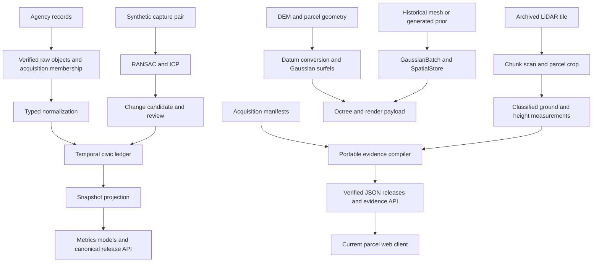

# OpenPali systems design space and research experiment

This map starts from the current working tree and asks which underlying mechanisms could make OpenPali a better instrument for understanding a changing physical place. The strongest first experiment is a library of mergeable spatial evidence blocks: preserve the meaning of acquired data, compute summaries consistently across chunks, and compile separate measurement and display outputs. Its value would come from its contracts, incremental behavior, and measured limits. Parallel moments, spatial hierarchies, compiler representations, and provenance are established prior art; the proposed combination is a research hypothesis, not a claim of original mathematics.

The map covers data representations, algorithms, execution, hardware boundaries, reference implementations, and experiments. It does not assume that the interfaces, infrastructure, or historical demonstrations establish a deployed research system.

## Evidence and scope

Inspected on September 29, 2026. Git HEAD is `e3201b9e1ee90072c96ae580d4cc7a42ab1182cb`, with substantial existing working-tree changes. Conclusions refer to those files, including the newer portable evidence producer and web client. Earlier audits describe different client behavior.

Four evidence classes are used throughout:

| Class | What it supports |
| --- | --- |
| Source inspection | What a named implementation does, including assumptions and discarded fields. It establishes neither deployment nor accuracy. |
| Established prior art | Published mechanisms and concrete implementations. Their applicability here still requires evaluation. |
| Project-reported result | An archived OpenPali report or an external paper's result. These were produced under that project's conditions. |
| Measured in this investigation | Results of the linked local probe, with inputs, source hashes, environment, and limitations recorded. |

Proposed architectures, performance expectations, and experiment gates below are labeled as proposals or hypotheses. External reference implementations were inspected, but were not built or benchmarked here. The [reference manifest](2026-09-29-reference-implementations.json) records exact revisions and hashes of 24 implementation files. The [measurement record](2026-09-29-systems-measurements.json) and [reproducer](experiments/spatial_summary_probe.py) distinguish real archived LiDAR from synthetic probes.

## Actual paths through the source

The following map shows executable paths present in this working tree. The spatial exports have no splat consumer in the current web client.



### Civic evidence and immutable snapshots

[`ingestion/pipeline.py`](../../pipeline/openpali/ingestion/pipeline.py) orders source acquisitions because the county defines parcel identity and permits supply inspection joins. Adapters yield raw records; acquisition retains verified object bytes and run membership. [`normalize.py`](../../pipeline/openpali/ingestion/normalize.py) converts source vocabulary into typed observations. A scheduled inspection remains activity, and selecting private cleanup remains a program choice.

The temporal model in [`temporal.py`](../../pipeline/openpali/domain/temporal.py) distinguishes exact dates, intervals, and unknown occurrence dates. `observed_at` records knowledge availability. These are different coordinates: an event in March learned in September belongs in September's knowledge history even when its physical occurrence belongs in March.

[`snapshot.py`](../../pipeline/openpali/ingestion/snapshot.py) loads observations from explicitly selected acquisition runs, applies a cutoff, excludes targets of revisions effective by that cutoff, detects conflicts, groups evidence by parcel, and calls `project_lanes`. It constructs Python lists and dictionaries and writes bulk SQL rows. It currently recomputes the projection for the selected snapshot rather than maintaining a delta per changed parcel.

[`release.py`](../../pipeline/openpali/publication/release.py) freezes policies, source health, coverage, and selected spatial assets into a manifest. PostgreSQL promotion moves the authoritative release pointer transactionally; an object-store pointer is repaired after commit. Prefect in [`flows.py`](../../pipeline/openpali/orchestration/flows.py) runs tasks and retries selected failures. It is a workflow scheduler; the incremental algebra of evidence remains in the domain code.

**Design consequence:** the useful primitive is already closer to a temporal evidence relation than a property record. It can support as-of queries, retractions, provenance, and alternative projections without rewriting the acquired assertion.

### Portable evidence compilation and current web consumption

[`intelligence/build.py`](../../pipeline/openpali/intelligence/build.py) is a distinct executable path. It reads acquisition manifests, checks input hashes, joins parcel, cleanup, permit, assessor, listing, utility, and visual evidence, and builds a content-addressed JSON release. It computes parcel-edge neighborhood features by projecting to metric coordinates and querying a Shapely `STRtree` at 100, 250, and 500 metres. It also creates acquisition tasks with fixed priorities. Its permit projection is implemented separately in [`permits.py`](../../pipeline/openpali/intelligence/permits.py).

[`EvidenceRepository`](../../pipeline/openpali/intelligence/repository.py) verifies immutable artifact hashes, then caches parsed releases. The [`evidence API`](../../pipeline/openpali/api/routers/evidence.py) searches and filters Python property collections. The current [`Map.tsx`](../../web/src/Map.tsx) fetches a release-qualified parcel GeoJSON and renders fills and outlines through MapLibre. The former splat renderer is deleted in this working tree; backend splat code survives.

**Design consequence:** there are several executable producers with different representations and projections. A shared semantic operator vocabulary would let them compile to SQL, columnar batches, or portable artifacts. Replacing an HTTP framework would not reconcile those semantics.

### LiDAR measurement and the cost of selecting a small region

[`crop_lidar_sample.py`](../../scripts/crop_lidar_sample.py) streams an ordinary LAZ tile in million-point chunks, rejects points outside the parcel's bounding box, then clips candidates to a parcel plus 5 m context buffer. Bounded memory does not mean selective I/O: this implementation decodes every point in the selected tile.

[`intelligence/visual.py`](../../pipeline/openpali/intelligence/visual.py) reads the archived crop with laspy, selects classified ground, builds a SciPy `cKDTree` over ground XY coordinates, and queries the nearest ground point for each surface return. It reports surface elevation minus nearest ground elevation when ground lies within 2 m. Those are geometric observations; high vegetation, rubble, and buildings can all contribute elevated returns.

**Measured:** the local tile has 20,118,164 points and the crop has 52,808. The extraction report records a full scan, equivalent to about 381 decoded source points per retained point. That ratio is work selectivity, not an estimated speedup for an index.

**Measured:** the full file has a compound horizontal and vertical CRS in an extended LAS metadata record (`LASF_Projection`, record 2112). The crop has no extended metadata records and no embedded CRS. The height program succeeds using the documented CRS override from the acquisition manifest. This is a concrete case where preserving coordinates alone does not preserve their interpretation.

### Raster and geometric data becoming display primitives

[`spatial/derive.py`](../../pipeline/openpali/spatial/derive.py) assembles verified DEM tiles into a full mosaic, checks seams, rasterizes parcel labels, computes terrain gradients and normals, performs a grid-based datum conversion, converts positions to ECEF, and builds Gaussian surfels. It directly exports a splat octree and a terrain image pyramid. Full-array mosaics, gradients, and intermediate arrays impose an execution schedule and memory demand.

[`geodesy.py`](../../pipeline/core/spatial/geodesy.py) uses float64 absolute ECEF coordinates and local east-north-up coordinates for registration and rendering. PROJ supplies datum transformations and can fetch geoid grids. Coordinate frame, unit, vertical reference, grid version, and local origin are therefore computational inputs, not optional display labels.

[`GaussianBatch`](../../pipeline/core/spatial/schema.py) is a structure of arrays: position, time, scale, quaternion, alpha, spherical harmonics, and APN. A point can be represented as a tiny Gaussian, and a geometric face as a thin Gaussian disk. A separate `SpatialStore` route writes these batches into H3-partitioned Parquet and a GeoParquet asset index. `to_arrow` computes H3 cells using Python loops; `read` uses Arrow filters but materializes the selected table and reconstructed arrays. The DEM derivation does not automatically travel through this Parquet route.

The unified Gaussian schema omits LAS classification, return structure, and sensor ray origin. Those fields matter to the height algorithm and visibility reasoning. `concat` also retains the first batch's scalar `source` and `kind`. The older [`runner.py`](../../pipeline/core/spatial/runner.py) passes the processing epoch into prior extraction. A stronger representation must preserve measured samples, historical geometry, and generated priors as distinct semantic types, even when all can be displayed as splats.

[`splat_tiler.py`](../../pipeline/core/spatial/splat_tiler.py) converts ECEF to a common local frame, recursively partitions an octree, sorts voxel groups, constructs covariance matrices, solves eigenproblems, and packs render records. Internal nodes merge child representatives. The merger applies fixed 0.1 covariance shrinkage, scale caps, and opacity caps. The comment names Ledoit–Wolf conditioning, but this implementation uses a fixed shrinkage intensity rather than fitting that estimator. `geometricError = cube_size / 4` is a traversal heuristic; it is not a measured surface-error certificate.

Each packed record has 32 bytes: float32 position and scale, byte RGBA, and byte quaternion. APN, acquisition time, higher harmonics, and measurement confidence are absent. Asset manifests and parcel picking bounds provide other context, but the packed record cannot recover the individual sample's identity or time. The internal merger averages `t_epoch`, which has no meaning as a new sensor acquisition.

### Registration, candidates, and model training

[`registration.py`](../../pipeline/core/spatial/registration.py) removes outliers, downsamples, forms local geometric descriptors, proposes correspondences, runs RANSAC with rigid Kabsch solves, and refines using trimmed and Mahalanobis-gated ICP. Kabsch estimates rotation and translation by SVD. The solve is rigid, so it assumes metric scale is already known. Saliency filtering tries to avoid fitting only self-similar terrain.

[`reconstruction.py`](../../pipeline/openpali/spatial/reconstruction.py) exercises this implementation with a synthetic two-epoch scene and withheld transform. Its change candidate compares counts of points above an elevation threshold inside a region and combines that ratio with residual and coverage terms. This score is a heuristic confidence, not an empirically calibrated probability. Review acceptance appends a civic observation; retraction preserves an audit trail. The `gpu_probe` checks NVIDIA device and driver availability; it is not a neural reconstruction implementation.

[`ml/dataset.py`](../../pipeline/openpali/ml/dataset.py) builds one risk unit per qualifying application, restricts features to their historical availability, and distinguishes issued outcomes from censoring. It gates the challenger on acquisition history. [`experiments.py`](../../pipeline/openpali/ml/experiments.py) fits survival baselines and a Cox model and records runs through MLflow. The portable permit timing summary is separately a median among completed observations. A model of agency event timing does not directly estimate physical construction.

### Execution and hardware map

| Work | Present execution boundary | Research implication |
| --- | --- | --- |
| Acquisition and manifest verification | Python/httpx, object bytes, hashing, database transactions | Latency, completeness, and replay dominate many small operations. |
| Spatial neighborhood and registration | Shapely/GEOS, SciPy spatial trees, NumPy, small SVD and eigen solves | Irregular queries and correspondence search have different schedules from raster stencils. |
| Raster and datum processing | GDAL/rasterio, PROJ/pyproj, full NumPy arrays | Tile halos, transform grids, cache locality, and intermediate allocation matter. |
| Point decoding and columnar storage | laspy with lazrs, Arrow/Parquet, H3 indexing | Data layout and bytes decoded may dominate arithmetic. |
| Display | Current MapLibre polygon client; former renderer available only in history | Browser rendering needs its own payload and hardware measurements. |
| Reconstruction acceleration | NVIDIA availability probe | CUDA support has not established an executable real-capture trainer here. |

The local probes ran on Darwin arm64 with Python 3.12.11 and NumPy 2.4.6. They measured no hardware GPU workload. One run's duration is recorded for reproducibility, not presented as a throughput benchmark.

## Mechanisms that expand the design space

### Maintain evidence with signed updates and provenance

**Concept through OpenPali:** a correction to one permit should remove that permit's contribution and recompute affected lanes and aggregates. Represent membership changes as `(record, logical epoch, signed multiplicity)`: adding evidence contributes +1, removing active membership contributes -1. The archival assertion itself remains retained. A boolean milestone needs a support count or support set so retracting one of two supporting records does not erase the other.

This is incremental view maintenance. Differential Dataflow also handles iterative computations using partially ordered logical time. Its time is an execution/version coordinate; it does not replace occurrence dates or knowledge availability. Its source `reduce.rs` recomputes keyed reductions at relevant times, and its trace implementation distinguishes physical compaction from logical compaction that sacrifices historical distinctions. Those distinctions matter to OpenPali's as-of guarantees. See the [CIDR paper](https://www.cidrdb.org/cidr2013/Papers/CIDR13_Paper111.pdf), [keyed reducer](https://github.com/TimelyDataflow/differential-dataflow/blob/aa8745f93ea8abe131104fc7885ba4fd47e63902/differential-dataflow/src/operators/reduce.rs), and [trace compaction contract](https://github.com/TimelyDataflow/differential-dataflow/blob/aa8745f93ea8abe131104fc7885ba4fd47e63902/differential-dataflow/src/trace/mod.rs).

Provenance adds another algebra. If evidence A or B independently supports a result, a provenance expression records `a + b`; if A must be joined with permit qualification C, it records `a*c`. These symbols represent derivation dependencies, not probabilities. The classic positive-query semiring does not by itself implement OpenPali's negation, cutoff, conflict, or retraction policies. See [Provenance Semirings](https://www.cs.ucdavis.edu/~green/papers/pods07.pdf).

| Route | Concrete opportunity |
| --- | --- |
| Use existing technology | Start with SQL or Python projections of dirty parcel keys and retain the current pure functions as the reference. Differential Dataflow supplies a broader incremental engine if iterative identity graphs justify it. |
| Extend or specialize | Define versioned operators for occurrence intervals, as-of membership, multi-parcel joins, conflict generation, and explainable lane support. |
| Investigate a new primitive | A temporal evidence relation that compiles one policy into batch artifacts and incremental views and can answer why a result changed between releases. Its utility and generality remain hypotheses. |

**Work removed:** repeated whole-snapshot normalization and projection after sparse changes. Shared arrangements can also avoid rebuilding the same joins for several outputs.

**Assumptions exploited:** most updates are local, stable identities exist, and policies have explicit dependency boundaries. **Failure cases:** policy changes may invalidate every row; geometry or identity splits can have broad effects; stateful indexes cost memory; upstream incompleteness remains incomplete; aggressive trace compaction can destroy required historical views. A full engine may be unnecessary at today's parcel count. Measure the dirty-key baseline first.

### Compile typed spatial evidence into different outputs

**Concept through OpenPali:** a thin surfel's covariance describes the shape drawn on screen. A survey sample's uncertainty describes where the measured surface might really be. These are different quantities even when both are 3 by 3 matrices. Likewise, alpha is opacity, not confidence, and a generated footprint prism is a geometric prior, not a sensor observation.

An intermediate representation, or IR, describes operations and types before choosing a low-level layout. OpenPali could express `classify_ground`, `normalize_height`, `transform_frame`, `summarize`, and `render_surfels`, with explicit capture, source, units, and loss contracts. A verifier could reject a height difference across incompatible vertical references or an attempt to promote a generated prior to measured change. This verifies declared contracts; it does not prove that an agency's metadata or a sensor reading is physically correct.

MLIR provides extensible types, operations, and dialect verification. Its `Verifier.cpp` invokes dialect attribute checks and operation invariants. That is a concrete infrastructure option once the vocabulary stabilizes; a Python reference IR is sufficient for the first experiment. See [MLIR's paper](https://arxiv.org/abs/2002.11054), [dialect documentation](https://mlir.llvm.org/docs/DefiningDialects/), and [verification implementation](https://github.com/llvm/llvm-project/blob/3a2f13ff993961e7bd745a37d6f163fe46657150/mlir/lib/IR/Verifier.cpp).

| Route | Concrete opportunity |
| --- | --- |
| Use existing technology | Retain native point, mesh, and raster data; use Arrow buffers for computation and separate render exports. |
| Extend or specialize | Add typed capture/frame metadata and operation contracts to the existing batch and asset interfaces; eventually express them as a compiler dialect. |
| Investigate a new primitive | Spatial blocks with immutable membership, mergeable statistics, provenance, and declared approximation limits that compile to both measurement queries and render payloads. |

**Work reorganized:** source-specific metadata reconstruction and validation become common operators; layout, export, and incremental recomputation become compiler decisions. Raw acquisition evidence remains available for refinement.

**Assumptions exploited:** important computations can be named with stable semantics and shared across consumers. **Failure cases:** an over-general IR becomes a second software platform; a common schema can erase modality-specific fields; statistics cannot preserve every query; source errors cannot be repaired by type checking. The prototype should support a few specified operations, not arbitrary reconstruction.

### Build visual hierarchies from conserved quantities

**Concept through OpenPali:** a parent representative must retain the total contribution of its children if it will later be merged again. A display alpha modified by clipping is a poor substitute for that contribution. Associativity means that `(A merge B) merge C` and `A merge (B merge C)` represent the same declared summary. It enables streaming, parallel reduction, caching, and reproducible update trees.

The [Hierarchical 3DGS paper](https://arxiv.org/abs/2406.12080) develops visual merging, hierarchy selection, transitions, and optimization of internal nodes. The inspected [`ClusterMerger.cpp`](https://github.com/graphdeco-inria/gaussian-hierarchy/blob/677c8553dc64dfd62c272eca94a291a277733113/ClusterMerger.cpp) weights a child by opacity times `ellipseSurface(scale)`, merges second moments, and derives parent falloff from retained contribution. The paper permits internal falloff above one and applies appropriate clamping during blending. OpenPali instead weights means by alpha alone, uses a different area proxy for parent alpha, clamps the stored parent alpha, and repeatedly shrinks covariance. These are materially different algorithms.

The reference's [`train_post.py`](https://github.com/graphdeco-inria/hierarchical-3d-gaussians/blob/596dc7081ee74e57a66502f4746328911f763b34/train_post.py) samples hierarchy cuts, blends levels, and optimizes image losses using CUDA. OpenPali's hierarchy is analytically generated from available geometry. It does not reproduce the reference's image-based optimization. The reference merger is supplied for noncommercial research and evaluation under its stated license; its algorithm is useful prior art, while deployment reuse of that implementation needs a compatible route.

| Route | Concrete opportunity |
| --- | --- |
| Use existing technology | Use a conventional mesh or terrain heightfield for suitable geometry; study hierarchical splat merging and selection for visual data. |
| Extend or specialize | Retain cumulative mass separately from display opacity, apply display clamps only when producing a representative, preserve capture partitions, and evaluate transitions. |
| Investigate a new primitive | A hierarchy whose nodes expose specified query summaries, source membership, and approximation limits as well as drawable content. |

**Work removed or reorganized:** conserved summaries avoid revisiting leaves for every upper-level merge; a shared hierarchy can serve progressive queries and display. An opaque depth-tested representation can avoid transparency sorting where its surface assumptions hold. A heightfield is especially compact for terrain, but cannot represent overhangs or multiple surfaces at the same XY location.

**Assumptions exploited:** local spatial coherence, limited required precision at distant views, and stable contributions. **Failure cases:** one Gaussian can bridge two disconnected surfaces; visual energy proxies depend on view and overlap; thin surfels violate near-isotropic approximations; fewer splats can still cover more pixels. Neither a moment matrix nor the current `geometricError` bounds arbitrary surface or photometric error.

### Preserve visibility with a sparse volume

**Concept through OpenPali:** a roof missing from a second point cloud may have been removed, hidden by a tree, or missed by the survey. Only observations that actually interrogated the region can distinguish these explanations. An unobserved voxel is different from observed free space.

A truncated signed distance field, or TSDF, stores a weighted signed distance near observed surfaces. It combines depth observations using their ray geometry. An ESDF stores Euclidean distance to a surface for clearance queries. Occupancy grids can instead retain free, occupied, and unknown evidence. These representations answer different questions from a radiance field, whose optimization target is rendered appearance.

The original weighted volumetric mechanism is [Curless and Levoy's range-image integration](https://www-graphics.stanford.edu/~levoy/publications.html). [Voxblox](https://arxiv.org/abs/1611.03631) reduces ray work by grouping endpoints and maintains an ESDF with raise/lower queues for changed distance dependencies. Its [`voxel.h`](https://github.com/ethz-asl/voxblox/blob/c8066b04075d2fee509de295346b1c0b788c4f38/voxblox/include/voxblox/core/voxel.h) explicitly records `observed` and, for some uses, `hallucinated` state. [`updateTsdfVoxel`](https://github.com/ethz-asl/voxblox/blob/c8066b04075d2fee509de295346b1c0b788c4f38/voxblox/src/integrator/tsdf_integrator.cc) computes a ray distance, adjusts weights, and clamps distance and accumulated weight. Those clamps also limit simple reversibility.

| Route | Concrete opportunity |
| --- | --- |
| Use existing technology | Test Voxblox's CPU integration with actual posed depth/range captures. |
| Extend or specialize | Preserve separate capture epochs, observed-space masks, and acquisition provenance; distinguish free-space evidence from planning assumptions. |
| Investigate a new primitive | A dated observation field whose change query reports support for occupied, free, and unknown regions and can refine ambiguous results. |

**Work removed:** repeatedly rebuilding nearest-neighbor comparisons and interpreting lack of returns as absence. Sparse blocks also avoid a dense volume over the entire area.

**Assumptions exploited:** rays or depth views and poses are known with usable uncertainty. **Failure cases:** the current flattened crop alone lacks the full ray/trajectory information required for defensible free-space carving; glass, vegetation, pose drift, and thin surfaces complicate fusion; fusing different epochs can erase change; treating a planner's filled unknown region as surveyed truth would be incorrect. This direction becomes testable after acquiring suitable posed captures.

### Solve repeated registration jointly

**Concept through OpenPali:** if captures A, B, and C overlap, aligning each independently to a fixed historical surface discards constraints between captures. A factor graph has variables such as capture poses and factors such as overlap matches, surveyed control points, and trajectory observations. It can revise an earlier pose when a new constraint arrives.

[iSAM2](https://www.cs.cmu.edu/~kaess/pub/Kaess12ijrr.pdf) maintains a factorization represented by a Bayes tree. GTSAM's [`ISAM2.cpp`](https://github.com/borglab/gtsam/blob/c786d78c5a4ec6390890ab2adb98fc5581f187d7/gtsam/nonlinear/ISAM2.cpp) removes and recalculates affected tree portions and selectively relinearizes; the inspected implementation switches to a batch step when a sufficiently large fraction of variables is affected. Incrementality therefore depends on graph structure, not a universal constant update cost.

[TEASER](https://arxiv.org/abs/2001.07715) addresses a different part of the problem: robust initial registration under bad correspondences using truncated least squares, invariant measurements, and graph-based rejection. The [`registration.cc`](https://github.com/MIT-SPARK/TEASER-plusplus/blob/52a9c52ee7d4c838c5e8a75458c33178be5bfb70/teaser/src/registration.cc) implementation includes graduated nonconvexity for rotation; [`certification.cc`](https://github.com/MIT-SPARK/TEASER-plusplus/blob/52a9c52ee7d4c838c5e8a75458c33178be5bfb70/teaser/src/certification.cc) supplies a separate certification path. A certificate concerns the chosen estimation objective under its assumptions; it does not establish that a match depicts the same physical structure.

| Route | Concrete opportunity |
| --- | --- |
| Use existing technology | Compare TEASER++ initialization with existing RANSAC; use GTSAM for a small multi-capture pose graph. |
| Extend or specialize | Separate stable control geometry from changed buildings, record pose uncertainty and datum corrections, and add removal/reintegration when poses change. |
| Investigate a new primitive | A registration service that returns a transform with its supporting constraints, observable directions, uncertainty assumptions, and downstream invalidation set. |

**Work reorganized:** independent retries become a shared constrained estimation problem; uncertainty becomes an input to change analysis. **Assumptions exploited:** the graph has reliable overlap or surveyed anchors and enough geometric diversity. **Failure cases:** planar terrain leaves some motions weakly constrained; bad loop closures corrupt several captures; systematic datum errors resemble genuine movement; metric LiDAR and unscaled monocular reconstructions need different transformation models. A low ICP residual alone does not establish observability.

### Move less data and separate algorithms from schedules

**Concept through OpenPali:** the crop keeps about 0.2625 percent of a full tile's points. Adding processor cores cannot remove the requirement to decode the rest under the present file layout. Spatial indexing changes the amount of work before parallelism changes its execution speed.

[COPC](https://copc.io/) associates compressed LAZ chunks with an octree hierarchy, including byte offsets and counts. laspy's inspected [`copc.py`](https://github.com/laspy/laspy/blob/b4e14088d24e7e23f72fd9d33d61f63a9668cb74/laspy/copc.py) traverses spatial selections, issues HTTP range reads, retrieves selected compressed chunks, and preserves decompression ordering. The local sample has no COPC info record. Supporting HTTP byte ranges alone does not add a spatial index to an ordinary LAZ tile. A conversion or external index has an initial cost and can pay off across repeated queries.

After reducing input, kernel scheduling matters. [Halide](https://people.csail.mit.edu/jrk/halide-pldi13.pdf) expresses an algorithm separately from choices about tiling, vectorization, storage, and recomputation. Its [scheduling lesson](https://github.com/halide/Halide/blob/95127ea3c889a95f3cdca3690c8b26365dc78d3e/tutorial/lesson_08_scheduling_2.cpp) demonstrates `compute_at` and `store_at`; its [lowering code](https://github.com/halide/Halide/blob/95127ea3c889a95f3cdca3690c8b26365dc78d3e/src/Lower.cpp) performs storage folding and GPU-related checks. This is directly relevant to DEM gradients and shading. It is less directly applicable to dynamic spatial trees and correspondence graphs.

The [Roofline model](https://www2.eecs.berkeley.edu/Pubs/TechRpts/2008/EECS-2008-134.pdf) bounds attainable arithmetic throughput by both compute capacity and memory bandwidth times operational intensity. Fusion can avoid writing a full gradient or normal array only to read it in the next stage. Higher theoretical FLOPS may offer little benefit when decoding, copies, irregular access, or pixel fill dominates. No Roofline characterization of OpenPali has been measured yet.

| Route | Concrete opportunity |
| --- | --- |
| Use existing technology | Index repeated point queries with COPC or an equivalent spatial index; use Arrow range/column selection and tiled raster processing. |
| Extend or specialize | Add parcel masks, required ground-neighbor halos, delta chunk indexes, and schedules for the project's stencil and reduction operators. |
| Investigate a new primitive | A planner that selects source chunks and numerical precision from a query's region, operation, and allowed approximation, then chooses a CPU or GPU schedule. |

**Work removed:** irrelevant decoding, unnecessary arrays, and repeated conversions. **Assumptions exploited:** spatially selective/repeated queries, bounded neighborhoods, and fixed dependencies. **Failure cases:** first-use conversion may cost more than one full scan; neighborhood queries require surrounding support; network requests can dominate many tiny chunks; unordered reductions change floating-point results; GPU transfers and synchronization can overwhelm small jobs. The measured 381 ratio establishes a reason to test indexing, not its benefit.

### Choose observations by expected information gained

**Concept through OpenPali:** the portable producer already creates `current_visual` and verification tasks, but priorities are fixed. A capture with three new angles may resolve an occluded region better than many nearly identical photographs. Capture utility depends on what remains unknown and on the overlap among planned observations.

Expected information gain measures how much an observation is predicted to reduce uncertainty. Submodularity describes diminishing returns: once one view covers a region, another redundant view adds less. [Krause, Singh, and Guestrin](https://jmlr.org/papers/volume9/krause08a/krause08a.pdf) establish approximation results for sensor placement under specified Gaussian-process and objective assumptions. Those guarantees do not automatically transfer to categorical recovery states, selective access, or occlusion.

| Route | Concrete opportunity |
| --- | --- |
| Use existing technology | Begin with explicit coverage set selection and a budgeted greedy baseline, rather than claiming calibrated information gain. |
| Extend or specialize | Learn capture success and delay from actual completed tasks, combine view geometry with unresolved query support, and include travel cost. |
| Investigate a new primitive | An acquisition query that returns which additional measurement could resolve a particular evidence gap, its expected benefit, and its source of uncertainty. |

**Work reorganized:** review queues and field collection become part of the measurement process. **Assumptions exploited:** outcomes and redundancy can be estimated. **Failure cases:** the acquisition model can be wrong; inaccessible parcels bias coverage; optimization can neglect difficult regions; observation delays confound physical progress. Test with adjudicated held-out tasks and compare to fixed priorities before assigning probabilities.

## What the local probes established

| Probe | Result produced here | Limit |
| --- | --- | --- |
| Archived parcel LiDAR heights | 23,454 ground points; 29,097 surface points; every included surface point had ground support within 2 m. Median height 0.270 m; p90 5.374 m; p95 7.412 m. All compared fields match the earlier measurement file. | One historical parcel plus context; no building label or current change established. |
| Metadata retention | Full tile contains the compound CRS in an extended record; the crop contains no such record. | The manifest retains interpretation; this probe did not repair the crop producer. |
| Three-splat regrouping | Direct centroid 1.000 m; merging 0 and 1 before 2 gives 1.654344 m; merging 1 and 2 before 0 gives 0.345656 m. | A synthetic characterization of `merge_cluster`, not an image-error estimate or a claim about every octree node. |
| Additive summary reference | The same inputs, weights, and Gaussian second moments produced identical additive statistics in the tested grouping. | One numerical example; no general floating-point proof or complete replacement renderer. |
| Coordinate precision | Float32 spacing at a representative ECEF location is 0.25, 0.50, and 0.25 m across axes; at local 100 m it is about 7.63 micrometres. | Format spacing, not sensor accuracy. Existing ECEF storage uses float64. |
| Existing registration fixture | Translation error 0.002 m; rotation error 0.002 degrees; no-change-control RMSE 0.1622 m. Existing gates passed. | Same synthetic fixture and rounded report values as the historical drill; no real registration generalization established. |

The historical [renderer report](../../openpali-one-shot/state/evidence/cp4b-renderer-bench-baseline-2026-07-12.md) used SwiftShader software rendering. Its first budget change reduced wide-view instances by 24.4 percent but increased p50 frame time; later hysteresis changed the outcome again. Those are project-reported results, not new measurements or hardware GPU speed claims. They illustrate why instances, bytes, pixels, sorting, and frame time must be measured separately.

## Recommended experiment

### A reusable library of mergeable spatial evidence blocks

**Research question:** can we preserve specified measurement queries and provenance while streaming, merging, and retracting spatial chunks, then generate display representations without allowing their approximation rules to alter the measurement summaries?

**Hypothesis:** a common block interface with separate measurement accumulators and visual parameters will make compilation independent of arbitrary chunk grouping, limit recomputation to changed dependencies, and retain enough context to explain derived results. It should be useful beyond parcels for repeat surveys, robot maps, and change monitoring. These benefits must be demonstrated individually.

The first product should be a small CPU library, a versioned block format, and an adversarial benchmark corpus. Its public operations can be `add_chunk`, `retract_chunk`, `summarize_height`, `lineage`, and `export_splats`. Use the present Python implementation as an oracle where its semantics are intentional. A compiler framework and GPU backend can follow after the contracts survive testing.

### Concepts needed to direct it

**Sufficient statistics:** a compact state sufficient for a specified calculation. For weighted means and covariances, retain total weight `W`, mean `mu`, and an unnormalized centered second moment `M2`. For two groups A and B with `delta = mu_B - mu_A`:

```text
W = W_A + W_B
mu = mu_A + delta * W_B / W
M2 = M2_A + M2_B + outer(delta, delta) * W_A * W_B / W
```

This preserves each group's contribution. For Gaussian mixtures, the accumulated second moment can additionally include weighted within-Gaussian covariance. Use stable local coordinates and established parallel central-moment formulas. [Pébay's Sandia report](https://www.osti.gov/servlets/purl/1028931) develops such parallel updates. The probe's simpler raw-sum reference illustrates the algebra but is not the preferred numerical implementation at Earth-scale offsets.

**A monoid:** a summary with an identity and an associative combine operation. Empty data is the identity; combining disjoint valid chunks does not depend mathematically on their grouping. Finite-precision computation still needs explicit tolerances. Associativity enables chunking, parallel execution, cache reuse, and consistent hierarchy construction.

**Reversibility:** retaining additive contributions permits a known chunk's contribution to be removed. Provenance must distinguish chunk identity so duplicate additions cannot double count. Some summaries are not invertible: removing the chunk containing the minimum requires recomputing a bound from remaining children. Covariance shrinkage, capped weights, clipping, and arbitrary resampling are generally not reversible operations. They belong in derived outputs or require retaining richer state.

**Query-specific approximation:** moments do not preserve a distribution's tails, topology, surface holes, or visibility. Add an exact-count fixed-bin height histogram for specified quantiles, with a declared rank convention and quantile intervals. Refine to raw data when a query cannot be answered from the summary. A render approximation's declared visual purpose does not supply a physical error bound.

**Observability and provenance:** every block retains a capture and source reference, declared coverage, coordinate frame and origin, transform version, parcel-label version, and operation version. Measurement covariance, geometric spread, and render footprint have separate fields. Raw LiDAR classification is retained until all operations needing ground support have executed. Known ray visibility can be added later; its absence is represented explicitly.

**Error budgets:** a change threshold must account for sensor error, registration uncertainty, datum uncertainty, and the chosen representation's approximation. Their covariance cannot always be added as independent errors: the same pose or geoid correction can affect many samples together. A common vertical bias does not disappear when millions of points are averaged. The first experiment should report arithmetic approximation separately from physical uncertainty and leave unsupported uncertainty estimates unknown.

### Experimental inputs and variants

Use the hash-verified 52,808-point crop for numerical checks and the available full 20,118,164-point tile for memory and work measurements. The source manifest identifies the historical acquisition date. Do not treat either as current site truth.

Add synthetic scenes with two separated walls, a flat plane, overlapping unequal-size groups, missing ground support, a datum offset, two capture epochs, parcel-boundary crossings, and a known retraction. Synthetic scaling data must stay labeled; replicated points are not independent real acquisitions.

Compare three mechanisms:

1. The current `merge_cluster` and fixed octree, recording centroid, covariance, opacity, and grouping sensitivity.
2. Conserved measurement accumulators plus an independently generated render representative, initially using the current packing layout.
3. The same block implementation under different chunk sizes, processing orders, and partition/reduction trees; add a selective source index as a separately measured variant.

For height normalization, use the same classified-ground rule and 2 m support limit as the existing measurement. A chunk needs the required surrounding ground halo. Process point identities exactly once, and compare results to the whole-crop reference. Changing the measurement definition or quantile convention requires a new operation version.

### Proposed gates before implementation

| Gate | Proposed criterion |
| --- | --- |
| Semantic context | Every output resolves to capture/source/frame/transform/policy membership. Incompatible capture cohorts, units, or frames cannot be merged without an explicit operation. |
| Grouping correctness | Exact counts and histogram bins agree. For the declared bounded local-coordinate corpus, means differ by at most 1e-9 m and covariance by relative tolerance 1e-9 plus absolute tolerance 1e-12 square metres. These are arithmetic consistency targets, not sensor accuracy. |
| Query preservation | Height quantile intervals enclose the raw-reference quantiles under the same rank convention; for the chosen 0.1 m binning, interval widths are at most 0.1 m. Ground-support failures remain unknown. |
| Retraction | Adding and retracting a known chunk reproduces the retained-data reference within the numerical tolerances; duplicate chunk addition is rejected or idempotent. Noninvertible bounds are rebuilt from surviving child metadata. |
| Display isolation | Changing display shrinkage, alpha caps, quaternion quantization, or LOD cannot change measurement summary bytes. Capture times are preserved as memberships or intervals, never averaged into a fictitious flight date. |
| Incremental work | A single leaf-chunk revision reads no unaffected raw leaf chunks when transforms and memberships are unchanged. Changed ancestors and bounds are counted. A global datum/policy change explicitly invalidates the required scope. |
| Memory | With a fixed chunk size and spilled hierarchy storage, a tenfold input increase stays within 1.5 times per-worker peak RSS. Measure index and metadata memory separately. |
| Honest performance | Record bytes read, decoded points, copied bytes where instrumentable, wall time, peak RSS, changed nodes, and query error. Measure initial indexing separately from repeated queries. Any GPU result identifies the actual device and timed transfer/kernel boundaries. |

These thresholds are proposed choices. A pilot should establish that the bounded corpus and quantile definitions make them meaningful; change a gate with a documented reason before the evaluation run, rather than tuning it to a favorable outcome.

### Execution sequence and decisions

First implement typed block membership and stable accumulators, and run the adversarial numerical corpus. This tests whether the representation is sound without a new application or renderer.

Next stream the real tile with fixed chunks, preserving full CRS metadata and classified-ground support. Compile measurement summaries and existing-format splats separately. Change one chunk, retract one chunk, and compare all specified queries to full recomputation. Then compare ordinary LAZ scanning against a prebuilt spatial index on a fixed list of parcel queries, including one query that needs neighboring ground.

Finally evaluate display quality using fixed cameras and an explicitly identified renderer/device. Measure image error and geometric query error separately. The working tree's removed renderer should not force the first numerical experiment to depend on restoring the entire former application.

**Advance** if contracts survive adversarial input, retractions match full recomputation, and repeated selective work decreases enough to justify retained metadata. **Narrow** the interface if useful queries repeatedly require unavailable raw or visibility information. **Stop the shared-summary direction** if preserving the required queries makes summaries as expensive as raw data or if the desired approximate operations cannot be separated coherently from their consumers. That would still produce useful counterexamples and an evaluation corpus.

A subsequent experiment can add posed depth captures and compare visibility-aware occupancy to point-count differencing. A separate evidence experiment can compare dirty-parcel projection against full snapshots. A multi-capture graph becomes worthwhile when real overlapping, independently anchored captures exist. Their prerequisites are different, so success in the block experiment should not be presented as validation of those later mechanisms.
