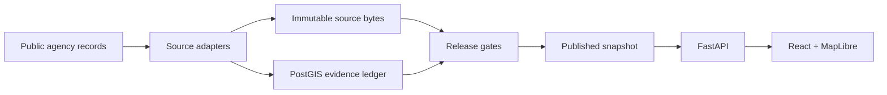

<p align="center">
  <a href="https://andrewwilliamross.github.io/openpali/">
    
  </a>
</p>

<p align="center">
  <a href="#start-building">Start building</a> ·
  <a href="#how-it-works">How it works</a> ·
  <a href="CONTRIBUTING.md">Contribute</a> ·
  <a href="https://andrewwilliamross.github.io/openpali/">Website</a> ·
  <a href="Docs/Brand/README.md">Brand kit</a>
</p>

<p align="center">
  <a href="https://github.com/Andrewwilliamross/openpali/actions/workflows/ci.yml"></a>
  
  
</p>

# A clearer picture, built together.

**OpenPali is a public evidence platform for the rebuild after the January 2025 Palisades Fire.** It brings fragmented agency records into a map, with separate evidence lanes for cleanup, design review, permitting, construction, and occupancy.

The point is simple: make it easier to understand **what the public record actually documents**, and to follow a claim back to its source.

Built by [RE\SPRING](https://respring.ai), with room for people who care about maps, public data, thoughtful software, and their neighbors. OpenPali is an independent civic project.

> **Public project, under active development.** The frontend includes a bundled data snapshot for local exploration. Service-backed releases, corrections, and estimates require the platform stack. See [licensing](#license-and-data-rights) for the current reuse terms.

## What you can explore

| Surface | What it helps you understand |
| --- | --- |
| **A shared map** | Parcel-level records across the Palisades recovery area, with a 2D view and optional 3D layers. |
| **Separate evidence lanes** | Cleanup, design review, permitting, construction, and occupancy can each have their own documented events. |
| **A traceable timeline** | Source records, observations, and dates behind a property's documented milestones. |
| **Published releases** | A platform designed around versioned snapshots, retained source bytes, release gates, and rollback. |
| **Careful analytics** | Denominators and uncertainty travel with the result. Permit estimates are suppressed when the evidence or model approval is insufficient. |

### The record is the starting point

- **Evidence before inference.** A milestone needs a documented event. OpenPali does not assign a rebuild score or rank owners.
- **Unknown stays unknown.** Missing public evidence is not evidence that nothing happened.
- **Dates mean different things.** An event date, an observation date, and a release date are kept distinct.
- **Corrections belong in the process.** Use the property's report path in a running deployment, or report a public source discrepancy through the [data correction form](https://github.com/Andrewwilliamross/openpali/issues/new?template=03-data.yml). Keep personal contact details out of public issues.

## Start building

### Explore the frontend

Use **Node.js 24** and npm. The map can run from the bundled snapshot without the Python services:

```sh
git clone https://github.com/Andrewwilliamross/openpali.git
cd openpali/web
npm ci
npm run dev
```

Open the local URL printed by Vite. Snapshot content is not a claim of current conditions; some platform features need the API. See the [frontend guide](web/README.md) for the boundary.

### Work on the platform

Use **Python 3.12**, Node.js 24, and Docker Compose for the service stack. From the repository root:

```sh
./scripts/bootstrap       # Install host dependencies; does not start services
./scripts/check-fast      # Unit suites, frontend lint/typecheck, OpenAPI drift
```

Follow the [local stack guide](infra/README.md) to build and start services, migrate the database, initialize storage, and load a development release. [`scripts/check-full`](scripts/check-full) runs the broader local checks; read its requirements before running it.

Working only on the project website? It needs just Python:

```sh
python3 scripts/build-site.py
python3 -m http.server 4173 --bind 127.0.0.1 --directory dist/site
```

## How it works



The current platform is a modular Python monolith with workers and a React client. The ledger retains observations over time, source bytes are content-addressed, and the release API serves artifacts selected by a published manifest. The frontend also retains a static snapshot path for local exploration.

| Directory | Start here for |
| --- | --- |
| [`pipeline/openpali/`](pipeline/openpali/) | Domain semantics, source adapters, ledger, API, analytics, ML, and spatial pipelines. |
| [`web/`](web/README.md) | React, TypeScript, MapLibre, and the generated API client. |
| [`infra/`](infra/README.md) | PostGIS, object storage, Prefect, MLflow, API, and local operations. |
| [`contracts/`](contracts/) | The checked-in OpenAPI contract. |
| [`site/`](site/README.md) | The small project website. |
| [`assets/brand/`](assets/brand/) | Original marks, banners, social images, and ASCII art. |
| [`Docs/`](Docs/README.md) | Research, decisions, planning, and historical prototype documents. |

For technical priorities and their context, see the [roadmap](ROADMAP.md). Historical prototype code and documents remain in the repository; their old scoring model is not the current product contract.

## Bring your square.

A useful contribution can be small: a clearer sentence, a keyboard fix, a reproducible bug report, a source adapter, or a better test for an ambiguous record.

1. Read the [contributor guide](CONTRIBUTING.md).
2. Browse [issues](https://github.com/Andrewwilliamross/openpali/issues), or propose a focused improvement.
3. Explain what changes for a user and how you checked it.

We welcome careful work from developers, designers, researchers, and people who know the public records. Please follow the [community guidelines](CODE_OF_CONDUCT.md). Report vulnerabilities privately through the [security policy](SECURITY.md).

<details>
<summary>A little terminal spirit</summary>

```text
  [][][][]
  []      []
  []      []
  [][][][]
  []
  []
  []

  openpali
  Recovery, in the open.
```

The [brand kit](Docs/Brand/README.md) includes transparent vectors, social cards, and the text mark. Its square fields are decorative, not a representation of recovery progress.

</details>

## License and data rights

The source-code license is **not yet selected**. This is a public repository; no open-source license is granted at present. A public repository alone does not settle reuse rights.

Government records, imagery, basemaps, and vendor-derived assets have their own terms and attribution requirements. Rights-unresolved assets are excluded from public releases by default. Any future software license will not automatically grant rights to those assets.

---

**Build in the open. Keep the evidence clear.**
