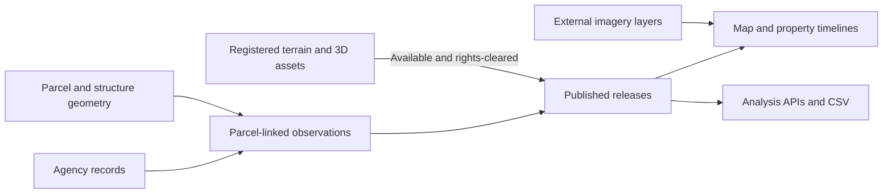

<p align="center">
  <a href="https://andrewwilliamross.github.io/openpali/">
    
  </a>
</p>

<p align="center">
  <a href="#start-building">Start building</a> ·
  <a href="#connect-explore-analyze">Platform overview</a> ·
  <a href="#contribute">Contribute</a> ·
  <a href="https://andrewwilliamross.github.io/openpali/">Website</a>
</p>

**OpenPali brings siloed public records, geospatial data, and imagery into one platform for analyzing the Palisades rebuild.** It connects agency records to parcels and dated observations so developers and researchers can study rebuilding activity after the January 2025 Palisades Fire.

The platform combines source ingestion, a PostGIS data ledger, published snapshots, a map interface, and analysis APIs. Explore individual properties, compare documented milestones, and examine permit applications, issuance, backlog, and time to issuance with the underlying sources and limitations attached.

An independent civic project by [RE\SPRING](https://respring.ai), built for people working with rebuild data.

<p>
  <a href="https://github.com/Andrewwilliamross/openpali/actions/workflows/ci.yml"></a>
  
  
</p>

> **Public project, under active development.** A bundled snapshot supports local map exploration. Release APIs, analytics, and corrections require the platform stack. The source-code license is [not yet selected](#license-and-data-rights).

## Connect, explore, analyze

| Work with the data | What OpenPali implements |
| --- | --- |
| **Connect sources** | Adapters for County parcel and debris records, LADBS permits and inspection requests, CAL FIRE damage assessments, LA City permit and occupancy records, and Malibu rebuild markers. Records retain their source identity and dates. |
| **Explore in context** | Parcel geometry, property timelines, and separate cleanup, design review, permitting, construction, and occupancy lanes in a React + MapLibre interface. Optional imagery and 3D layers add spatial context. |
| **Analyze the rebuild** | Milestone prevalence, weekly permit application and issuance counts, backlog and throughput, and time-to-issuance analysis. Published releases expose metrics through APIs and research CSV exports. |



Spatial inputs have their own scope and dates. Optional imagery layers come from external tile providers; the implemented USGS LiDAR workflow derives terrain for a fixed Alphabet Streets area. Registered terrain and 3D assets depend on the release and their reuse terms. Historical imagery and terrain provide context, not a measure of present construction activity.

See the [pipeline guide](pipeline/README.md) for ingestion, spatial processing, publication, and analysis commands, and the [metric definitions](pipeline/openpali/metrics/catalog.py) for populations, denominators, and time windows.

## Start building

### Open the map locally

Use **Node.js 24** and npm:

```sh
git clone https://github.com/Andrewwilliamross/openpali.git
cd openpali/web
npm ci
npm run dev
```

Open the URL printed by Vite. The bundled snapshot lets you explore the map without the Python services; its contents do not establish current conditions. API features need the platform below. See the [frontend guide](web/README.md).

### Work on the platform

Use **Python 3.12**, Node.js 24, and Docker Compose. From the repository root:

```sh
./scripts/bootstrap       # Install host dependencies; does not start services
./scripts/check-fast      # Unit suites, frontend lint/typecheck, OpenAPI drift
```

The [local stack guide](infra/README.md) covers building and starting services, database migrations, storage initialization, and a development release. [`scripts/check-full`](scripts/check-full) runs the broader local checks; read its requirements first.

<details>
<summary>Working on the project website?</summary>

It needs Python:

```sh
python3 scripts/build-site.py
python3 -m http.server 4173 --bind 127.0.0.1 --directory dist/site
```

See the [website guide](site/README.md).

</details>

## Inside the project

The platform is a modular Python monolith with workers, FastAPI, and a React client. Source bytes are content-addressed, observations are retained over time, and release APIs select artifacts through a published manifest. PostGIS stores the evidence ledger; release gates and rollback preserve an inspectable publication history. The frontend also keeps a static snapshot path for local exploration.

| Directory | Start here for |
| --- | --- |
| [`pipeline/openpali/`](pipeline/openpali/) | Domain semantics, source adapters, ledger, API, analytics, ML, and spatial pipelines. |
| [`web/`](web/README.md) | React, TypeScript, MapLibre, and the generated API client. |
| [`infra/`](infra/README.md) | PostGIS, object storage, Prefect, MLflow, API, and local operations. |
| [`contracts/`](contracts/) | The checked-in OpenAPI contract. |
| [`site/`](site/README.md) | The small project website. |
| [`assets/brand/`](assets/brand/) | Artwork and identity files; see the [brand guide](Docs/Brand/README.md). |
| [`Docs/`](Docs/README.md) | Research, decisions, planning, and historical prototype documents. |

See the [roadmap](ROADMAP.md) for technical priorities. Historical prototype code and documents remain in the repository; their old scoring model is retired.

## Working with the evidence

- **Keep sources and dates attached.** Event dates, observation dates, and release dates answer different questions. The five evidence lanes remain separate rather than collapsing into a rebuild score.
- **Account for missing data.** Missing public evidence does not mean nothing happened. Analyses carry denominators and uncertainty; permit estimates are suppressed when evidence or model approval is insufficient.
- **Make corrections traceable.** A running deployment can accept reports from a property's card. Public source discrepancies can also go through the [data correction form](https://github.com/Andrewwilliamross/openpali/issues/new?template=03-data.yml). Keep personal contact details out of public issues.

## Contribute

| Connect another source | Improve the analysis | Build a better interface |
| --- | --- | --- |
| [Source adapters](pipeline/openpali/adapters/) | [Metric definitions and computations](pipeline/openpali/metrics/) | [Frontend guide](web/README.md) |

Start with a focused change: strengthen a source adapter, check a metric definition, improve a map interaction, or clarify the setup. Read the [contributor guide](CONTRIBUTING.md), browse [existing issues](https://github.com/Andrewwilliamross/openpali/issues), and explain how you verified the result.

Follow the [community guidelines](CODE_OF_CONDUCT.md); report vulnerabilities through the [security policy](SECURITY.md).

## License and data rights

The source-code license is **not yet selected**. This is a public repository; no open-source license is granted at present. A public repository alone does not settle reuse rights.

Government records, imagery, basemaps, and vendor-derived assets have their own terms and attribution requirements. Rights-unresolved assets are excluded from public releases by default. Any future software license will not automatically grant rights to those assets.

---

**Understand the rebuild. Build with the data.**
