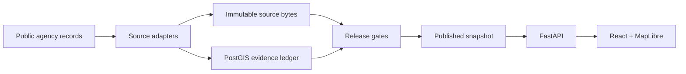

<!-- Historical copy proposal, superseded by the implemented root README. Relative links intentionally target the repository root. Original asset slots remain as part of the proposal. -->
<!-- ART: field-office README banner, descriptive alt text, full width -->

<p align="center">
  <a href="#start-building">Start building</a> ·
  <a href="#follow-the-record">Follow the record</a> ·
  <a href="#find-your-way-in">Contribute</a> ·
  <a href="https://andrewwilliamross.github.io/openpali/">Website</a>
</p>

# A place with footnotes.

**OpenPali brings public evidence for the Palisades rebuild into a shared map.** Follow the records behind cleanup, design review, permitting, construction, and occupancy after the January 2025 Palisades Fire.

The idea is simple: make a claim easier to check, a source easier to find, and a confusing record easier to question.

An independent civic project by [RE\SPRING](https://respring.ai), with room for developers, researchers, designers, and people who know the public records.

<p>
  <a href="https://github.com/Andrewwilliamross/openpali/actions/workflows/ci.yml"></a>
  
  
</p>

> **Public project, under active development.** A bundled snapshot supports local map exploration. Service-backed releases, corrections, and estimates require the platform stack. The source-code license is [not yet selected](#license-and-data-rights).

## Start building

### Open the map locally

Use **Node.js 24** and npm:

```sh
git clone https://github.com/Andrewwilliamross/openpali.git
cd openpali/web
npm ci
npm run dev
```

Open the URL printed by Vite. The bundled snapshot lets you explore the map without the Python services; its contents do not establish current conditions. API features need the platform below. See the [frontend guide](web/README.md).

### Work on the platform

Use **Python 3.12**, Node.js 24, and Docker Compose. From the repository root:

```sh
./scripts/bootstrap       # Install host dependencies; does not start services
./scripts/check-fast      # Unit suites, frontend lint/typecheck, OpenAPI drift
```

The [local stack guide](infra/README.md) covers building and starting services, database migrations, storage initialization, and a development release. [`scripts/check-full`](scripts/check-full) runs the broader local checks; read its requirements first.

<details>
<summary>Working on the project website?</summary>

It needs Python:

```sh
python3 scripts/build-site.py
python3 -m http.server 4173 --bind 127.0.0.1 --directory dist/site
```

See the [website guide](site/README.md).

</details>

## Follow the record

The map brings together parcel records, source-linked timelines, and optional 3D context. Its five evidence lanes stay separate: cleanup, design review, permitting, construction, and occupancy can each have their own documented events.

- **Keep the source attached.** A milestone needs a documented event. An event date, observation date, and release date mean different things.
- **Let unknown stay unknown.** Missing public evidence does not mean nothing happened. OpenPali does not assign a rebuild score or rank owners.
- **Leave room for correction.** A running deployment can accept reports from a property's card. You can also report a public source discrepancy through the [data correction form](https://github.com/Andrewwilliamross/openpali/issues/new?template=03-data.yml). Keep personal contact details out of public issues.
- **Keep the limits visible.** Published snapshots retain their lineage. Analytics carry denominators and uncertainty; permit estimates are suppressed when evidence or model approval is insufficient.

## Find your way in

<!-- ART: three illustrated role panels, useful text stays Markdown -->

| Follow a source | Improve the software | Question a record |
| --- | --- | --- |
| Help make agency records easier to trace and understand. Start with the [source adapters](pipeline/openpali/adapters/). | A keyboard fix, clearer label, or better test counts. Start with the [contributor guide](CONTRIBUTING.md). | Explain a public discrepancy and include the source. Start with the [data issue form](https://github.com/Andrewwilliamross/openpali/issues/new?template=03-data.yml). |

Browse [existing issues](https://github.com/Andrewwilliamross/openpali/issues), choose a focused change, and explain how you checked it. Follow the [community guidelines](CODE_OF_CONDUCT.md); report vulnerabilities through the [security policy](SECURITY.md).

## Inside the project



The platform is a modular Python monolith with workers and a React client. Source bytes are content-addressed, observations are retained over time, and release APIs select artifacts through a published manifest. Release gates and rollback preserve an inspectable publication history. The frontend also keeps a static snapshot path for local exploration.

| Directory | Start here for |
| --- | --- |
| [`pipeline/openpali/`](pipeline/openpali/) | Domain semantics, source adapters, ledger, API, analytics, ML, and spatial pipelines. |
| [`web/`](web/README.md) | React, TypeScript, MapLibre, and the generated API client. |
| [`infra/`](infra/README.md) | PostGIS, object storage, Prefect, MLflow, API, and local operations. |
| [`contracts/`](contracts/) | The checked-in OpenAPI contract. |
| [`site/`](site/README.md) | The small project website. |
| [`assets/brand/`](assets/brand/) | Artwork and identity files; see the [brand guide](Docs/Brand/README.md). |
| [`Docs/`](Docs/README.md) | Research, decisions, planning, and historical prototype documents. |

See the [roadmap](ROADMAP.md) for technical priorities. Historical prototype code and documents remain in the repository; their old scoring model is retired.

<details>
<summary>A note from the field office</summary>

```text
           __
      ____/o \__
     /    \___/ >    [1]
     \__  /             __/\__
        ||             /  /  /\
   ~~~~~~~            /__/__/__/

  openpali
  A place with footnotes.
```

A small coastal bird, a folded atlas, and a note to follow. The [field-office guide](Docs/Brand/FIELD-OFFICE.md) explains the artwork. The scene is illustrative; it does not represent property conditions or recovery progress.

</details>

## License and data rights

The source-code license is **not yet selected**. This is a public repository; no open-source license is granted at present. A public repository alone does not settle reuse rights.

Government records, imagery, basemaps, and vendor-derived assets have their own terms and attribution requirements. Rights-unresolved assets are excluded from public releases by default. Any future software license will not automatically grant rights to those assets.

---

**Help make the record clearer.**
