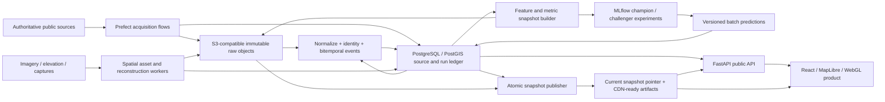

# OpenPali production MVP architecture

**Status:** implementation blueprint for the Fable 5 one-shot  
**Repository:** `springaixyz/openpali` / local `paliml`  
**Prepared:** 2026-07-11  
**Target:** a locally runnable, deployable release candidate—not a live deployment

## Executive decision

The one-shot must build a product platform, not merely a stronger task harness.
The existing harness is now the control plane for the run; it is not the
deliverable. Fable's implementation effort must produce all of the following:

1. a trustworthy, immutable recovery-data platform;
2. a real backend and versioned public API;
3. reproducible continual ML experimentation and safe forecast serving;
4. an operational 2D/3D spatial pipeline and browser experience;
5. complete resident, researcher, and community-recovery product journeys; and
6. CI, release, observability, security, privacy, rights, and governance
   foundations appropriate for a production MVP intended for later open-source
   release after Andrew's license decision.

The known source-semantics failures remain phase 0 because every downstream
feature would otherwise learn from or publish false labels. Phase 0 is a
dependency gate, not a replacement scope. Once its fixtures and fail-closed
checks pass, platform, ML, spatial, frontend, and operations work proceed in
parallel. A successful run cannot stop after repairing truth or producing a
static evidence page.

### The four corrections and their architectural consequences

| Correction | Required consequence |
|---|---|
| Too much harness work, too little engineering work | Freeze discretionary harness expansion at launch. Use its state and evaluator machinery, but direct implementation time to product paths outside `openpali-one-shot/`. |
| Quality work was allowed to displace ML and 3D/mapping | Make truth repair phase 0, then require independent ML and spatial workstreams with runnable services, schemas, tests, and public features. “Insufficient evidence” may suppress a forecast; it may not excuse building no experimentation platform. Rights may disable an asset; they may not excuse building no spatial asset pipeline. |
| Fable has the same local environment | Require Fable to run the complete local stack itself. The checked environment already has `uv`, Node/npm, Docker, and Docker Compose. Host-installed PostgreSQL or object-store CLIs are unnecessary because the services run in Compose. |
| OpenPali has very little backend architecture | Add a modular Python backend, PostgreSQL/PostGIS, immutable object storage, migrations, orchestration, model registry/tracking, API contracts, and operational health—not another collection of generated JSON files presented as a backend. |

### Harness correction applied before launch

The first draft of this task package conflicted with the requested architecture:
it described a “lightweight” future-learning path, a “bounded 3D pass,” and a
static-first posture that could pass without a backend. That draft also devoted
more code to transcript/terminal attestation than to the product build.

The launch package now treats this blueprint as authoritative product direction,
requires backend, orchestration, continual experiments, multimodal/spatial
engineering, and complete product integration, and uses the exact prepared
local checkout. The large custom stop loop and observer subsystem have been
removed in favor of the native `/goal` loop, executable component-specific
gates, and a fresh independent evaluator; only a small hook capture and
deterministic evidence-child verifier remain at the final boundary.

This blueprint does **not** mandate microservices, Kubernetes, automatic model
promotion, or a city-scale neural reconstruction during the one-shot. It does
mandate the backend, orchestration, continual-experiment, rights-safe spatial,
reconstruction-fixture, and 3D product foundations below. Their need is already
demonstrated by the requested MVP and by the current repository's absence of
those capabilities.

## What exists and what must be preserved

The implementation begins from the repository, not a greenfield rewrite.

### Useful current capabilities

- `pipeline/palisades/` already acquires County, LADBS, Malibu, and Socrata
  records and emits a civic snapshot. Its source adapters and APN utilities are
  migration inputs, not throwaway prototypes.
- `pipeline/palisades/model.py`, `score.py`, `emit.py`, and `validate.py`
  contain the present domain projection, scoring, artifact generation, and
  checks. They are the regression map for replacing mutable parcel-state
  derivation with an event ledger and snapshot projections.
- `pipeline/core/spatial/` already contains geodesy, registration, surfel,
  splat-tiling, scene-client, runner, and web-export work. The MVP should make
  these components versioned jobs behind a spatial asset registry rather than
  start over.
- `web/src/` already provides a React/MapLibre application, address search,
  property detail, a custom WebGL2 splat layer, picking, terrain, imagery, and
  rendering utilities. It should evolve into an API-backed product, not be
  replaced with a generic dashboard.
- The current static artifacts and GeoParquet files are valuable portable
  publication and research outputs. They remain deterministic derivatives of
  a canonical snapshot even after the backend exists.

### Current limits that determine the target

- There is no checked-in API service, database schema, migration system,
  canonical storage service, task worker, or production orchestration source.
  `pipeline/orchestration/` contains no checked-in implementation.
- The browser downloads coarse static payloads and has no server-side bbox,
  vector-tile, history, evidence, or forecast query contract.
- Raw HTTP cache entries are not an immutable source lake; a long cache TTL is
  currently used as “offline.” Publication is file-oriented rather than an
  atomic snapshot promotion.
- The score and completion date are heuristic outputs, not evaluated models.
  There is no feature registry, experiment tracker, model registry, promotion
  record, drift evaluation, or prediction store.
- The current `.splat` publication loses important observation semantics, the
  renderer can read a very large corpus, coverage is incomplete, and spatial
  acquisition/registration/training are not an end-to-end scheduled system.
- There is no CI workflow, reproducible deploy stack, observability plane,
  documented backup/restore, source-code license decision, or complete
  imagery/derivative rights gate.

### Verify the intended base before implementing

Local `HEAD` and `origin/main` have diverged. `origin/main` includes useful
advances that must be evaluated and preserved selectively:

- `752675b`: source provenance and expectation gates;
- `d207201`: renderable geometry/placeholders for every parcel;
- `6de5c16`: lazy loading/code splitting for the 3D renderer;
- `f8ab734`: WebGL state isolation fixes; and
- `0bb5e32`: post-fire DEM vertical-datum foundations.

Those commits are engineering inputs, not proof that the problems are solved.
For example, the remote source logic still retains the inspection, rebuild,
and cleanup semantics defects described below. Andrew must reconcile and commit
the intended starting branch before launch. Fable then verifies and records
that prepared base, compares the included work with the baseline, and runs the
gates; it must not fetch/pull/reset, erase local work, independently reimplement
already-good work, or treat the remote roadmap as authoritative truth.

## Production MVP system shape

Use a **modular monolith plus workers**, not microservices. One Python project
owns the domain model, database access, HTTP API, publication, analytics, and
job definitions. Prefect workers execute idempotent batch flows. PostgreSQL
with PostGIS is the operational/query store. S3-compatible object storage is
the immutable blob and artifact plane. MLflow records experiments and model
artifacts. The React client reads the API and immutable spatial/static assets.



### Why these dependencies are earned

| Component | Demonstrated need | Choice for the MVP |
|---|---|---|
| Relational/geospatial database | Cross-source identity, bitemporal corrections, point-in-time queries, API filtering, jobs, forecasts, and parcel geometry cannot be safely represented as one mutable JSON object. | PostgreSQL 17 + PostGIS 3.5, locally in Docker Compose. |
| Immutable object store | Raw responses, Parquet, model artifacts, tiles, splats, manifests, and visual evidence are large, content-addressed objects and should not be rows or mutable local cache files. | S3 API; a pinned SeaweedFS S3 service locally; AWS S3/R2/GCS-compatible adapter later. OpenPali hashes/manifests enforce immutability rather than assuming every S3-compatible server implements object lock. |
| Batch orchestrator | Scheduled multi-source refresh, retries, lineage, backfills, spatial jobs, model evaluation, and atomic promotion have different dependencies and failure boundaries. | Prefect 3 server and worker in Compose, with code-defined deployments. |
| Experiment tracking/model registry | Continual learning requires immutable dataset/config/code linkage, comparable runs, artifacts, and explicit champion promotion. | MLflow with PostgreSQL metadata and the same S3-compatible artifact store. |
| HTTP backend | The product needs point queries, bbox/vector tiles, histories, evidence, metrics, forecasts, source health, and corrections without downloading the whole city. | FastAPI + Pydantic + SQLAlchemy 2 + Alembic. |

Do not add Kafka, Kubernetes, a service mesh, a separate feature-store product,
or one service per source. None is necessary for the MVP's throughput or team
size. Interfaces and immutable records provide future separation points.

## Frozen MVP depth matrix

The following minimums prevent breadth from turning into seven disconnected
skeletons. Fable may add value after these pass, but may not redefine them
downward during the run.

### Source policy

| Adapter | Jurisdiction/unit | Criticality | Freshness/outage behavior | Required contribution |
|---|---|---|---|---|
| LA County parcel/debris layer | Declared damaged parcel universe across covered jurisdictions | Required for any release | A schema/domain failure or missing current/LKG acquisition blocks a new release | Identity/geometry, declared universe, cleanup evidence and coverage |
| LADBS Palisades permit layer | City of LA permit/application records | Required for City-of-LA metrics and ML | Critical schema/taxonomy failure blocks City publication; stale LKG stays visible | Qualifying rebuild application/approval/issuance/CofO evidence |
| LADBS inspection layer | City of LA inspection records | Required evidence source, never sole construction truth | Failure marks construction evidence unavailable and blocks claims that depend on it | Outcome-aware scheduled/attempted/failed/accepted observations |
| Socrata permit/CofO cross-checks | City of LA independent public tables | Required validation for named metrics, not identity authority | Failed reconciliation blocks affected metric/prediction promotion | Deep links and independently specified permit/CofO checks |
| Malibu dashboard adapter | Malibu coarse recovery status | Required only for Malibu coverage; never silently compared with LADBS event detail | Outage preserves LKG Malibu state with jurisdiction warning | Coarse jurisdiction-specific state and source-health disclosure |
| CAL FIRE DINS Palisades | Structure-damage assessments | Required consequential new source | Verify and freeze the master endpoint plus Palisades incident filter; acquire the full bounded result with uncapped pagination; outage preserves prior evidence and blocks new DINS-dependent output | Structure-level damage distribution, records with/without APN, deterministic APN/address/spatial join and ambiguity counts, and an independently checked joined property |
| USGS 2025 post-fire 3DEP | Real Palisades elevation AOI | Required real spatial source | Exact public-domain metadata/raw hashes replay offline; no proprietary fallback may masquerade as equivalent | Terrain/elevation context and a real source-to-browser spatial proof |

The representative release processes every applicable row above through the
registered worker/deployment path and records exact raw hashes. Its zero-network
replay must reproduce semantic outputs. Fixtures remain essential for failure
and edge cases, but cannot substitute for this run.
Malibu is applicable whenever the declared damaged universe intersects Malibu;
it is not a discretionary feature flag.

### Forecast target and evaluation

The first production ML target is fixed: for a qualifying fire-rebuild
application at its documented submission time, estimate censoring-aware time to
permit issuance and probability of issuance by 180 days. Construction and
occupancy remain separately reported descriptive/multi-state research targets
until their labels and follow-up support promotion.

One risk unit is one qualifying fire-rebuild permit application. Origin is its
documented submission time and the event is first issuance of that same
application. Withdrawal, cancellation, and expiration are predeclared as
competing events or censoring; multiple applications on one property remain
separate in API/product output. An origin estimate is labeled “estimated at
submission,” never a current ETA. After 180 days the product shows observed
outcome/current status or insufficiency, not a recycled horizon probability.

The corrected representative ledger always creates the real dataset,
late-entry/availability audit, sufficiency report, and statistically supported
naive/censoring-aware estimates. It fits a representative challenger only when
a precommitted methods-reviewed point-in-time-history gate passes; otherwise it
emits `INSUFFICIENT_POINT_IN_TIME_HISTORY`. Filesystem mtime, current-row
presence, retrospective status, and occurrence/outcome date do not establish
what OpenPali knew historically. A source field may establish earlier
availability only through a snapshotted field-level contract showing that it
was immutable and public then. The complete challenger, serialization, MLflow/
OpenPali registry, rejection, and serving path still executes on a nontrivial
temporal fixture.

Freeze the experiment specification and final cutoff in a commit before the one
allowed final-period evaluation. A fresh process must deserialize the selected
artifact and reproduce predictions. In the N to N+1 drill, N has an eligible
active application; N+1 adds a late-arriving eligible application and a
correction/retraction. Historical N features remain byte-identical, N+1 has a
new dataset hash and actual MLflow evaluation, and champion state does not
change without review. A semantically identical no-op snapshot creates neither
a duplicate dataset nor experiment. Failed/asynchronous evaluation never blocks
newer valid civic data: publication uses a compatible reviewed champion or a
typed insufficiency artifact.

### Metric catalog

At minimum, implement and independently reconcile:

1. damaged-universe denominator and source/identity coverage;
2. as-of prevalence for every parallel milestone lane and status class;
3. interval transition incidence and inflow/outflow throughput;
4. censoring-aware time to the selected transition, or restricted mean when a
   median is not estimable;
5. backlog plus inflow/outflow bottleneck measures by declared cohort/window;
   and
6. source, temporal, spatial, join, and outcome missingness/coverage.

Each definition fixes jurisdiction, population, unit, window, cutoff,
inclusion, suppression, sample size, uncertainty, validation, and comparison
behavior before values are observed.

For every declared milestone/window, backlog is eligible subjects lacking that
milestone at cutoff; inflow is subjects becoming eligible during the window;
outflow is subjects first reaching the milestone during the window; net flow is
inflow minus outflow; and throughput rate divides outflow by the declared
exposure or window. Time-to-transition is censoring-aware and minimum-sample
suppressed. A “bottleneck” is a disclosed conjunction or ranking of these
versioned quantities, never merely the largest stage count.

### Spatial and multimodal depth

- Run a bounded real USGS 3DEP Palisades AOI through acquisition, content store,
  registry, CRS/datum normalization, release selection, API, actual WebGL draw,
  picking, legend, and property evidence. Before execution, freeze the verified
  item/product metadata and a checked-in AOI polygon covering at least 25
  damaged-universe parcels and four independently requested LOD tiles. Produce
  a nonempty USGS-derived point/surfel representation through the production
  registration/surfel/tiler/custom-renderer path in addition to terrain.
- Use a separate nontrivial stress fixture containing overlapping translucent
  surfaces, coplanar geometry, dense splats, missing/fallback parcels, mixed
  vintages, registration offsets, canceled requests, and context loss.
- Select one asset per `(subject, kind, vintage_slot, release)` so explicit
  before/after vintages may coexist without accidental epoch concatenation.
- Every claimed enabled Gaussian/surfel/fallback vintage slot is nonempty and
  selected by release policy; an empty manifest placeholder does not count.
- A probabilistic multimodal candidate has asset, subject/region, hypothesis,
  confidence method, coverage, occlusion/quality, registration residual,
  model/process version, rights/privacy state, and review state. Only a reviewed
  acceptance appends a civic observation; reject/retract remains auditable and
  synthetic candidates can never become public facts.
- The reconstruction fixture has at least two partially overlapping noisy
  views/depth clouds, occlusion, mixed change/no-change geometry, and a withheld
  1.5 m/3 degree transform. Production code estimates the transform, fuses and
  tiles the asset, derives uncertainty from measured residual/coverage, and
  meets gates of at most 0.15 m translation error, 0.5 degree rotation error,
  and 0.20 m aligned RMSE. The optional GPU image runs its entrypoint without a
  GPU and returns typed `unsupported_hardware`.

### Golden journeys and failures

The property golden journey covers a qualifying application, conflicting or
late evidence, accepted/rejected correction, forecast/insufficiency, real
spatial coverage/fallback, direct route, source trace, and release pin. The
community journey covers every fixed metric, definition drill-down, time/cohort
filter, research export, source/model health, top-down evidence layer, and
opt-in 3D.

The full gate injects at least: source timeout, partial/repeated page, schema and
domain drift, concurrent duplicate acquisition, late correction, database
restart, worker death/resume, failed model/champion proposal, missing/right-
revoked spatial asset, mixed/delayed pointer, promotion during two pinned
sessions, API dependency failure, WebGL/context loss, and restore/rollback.

### Fixed performance profile

Record exact hardware/browser/network emulation, raw traces, variance, and the
same scene/release before and after optimization. On the prepared local release
profile, target:

- default 2D initial application transfer at or below 1.5 MiB compressed,
  excluding separately cached basemap tiles, with zero 3D asset requests;
- a 200-request mixed search/property/timeline/metric/MVT workload at 20
  concurrent clients, with cold and warm results separate: representative API
  p95 below 300 ms locally, property payload below 250 KiB, and one MVT response
  below 500 KiB at the benchmark viewport;
- 3D reference-scene first meaningful draw within 5 seconds on the recorded
  desktop profile, request concurrency at or below 8, p95 steady frame time at
  or below 33 ms, no GL errors, and no unbounded queue;
- ten-minute fixed-camera/pan soak with no more than 10% retained growth in
  renderer-owned buffer/texture bytes or JS heap after warm-up; and
- WCAG 2.2 AA core journeys with no serious/critical automated violations.

Browser APIs do not expose authoritative driver allocation on every platform.
Use renderer-owned buffer/texture accounting plus browser traces and clearly
label unavailable driver metrics rather than fabricating precision. If a fixed
budget is impossible on the prepared hardware, the evaluator may approve a
pre-optimization evidence-backed revision only when the user-visible MVP still
works and the revision is recorded before tuning—not after seeing a favorable
result.

Record whether every browser run is hardware accelerated or SwiftShader/
software. Headless/software runs prove correctness only; GPU-utilization,
allocation, and headed performance claims require a recorded hardware-accelerated
browser profile on the prepared machine.

## Repository layout

Keep the current Python project and migrate it incrementally. A concrete target
layout is:

```text
pipeline/
  openpali/
    domain/                 # enums, IDs, observations, policies; no I/O
    adapters/               # wrappers around palisades source clients
    storage/                # SQLAlchemy repositories, object-store client
    identity/               # APN/property/structure crosswalk resolution
    ingestion/              # acquisition and normalization services
    metrics/                # declared metric definitions and computation
    ml/                     # datasets, features, baselines, evaluation, registry
    spatial/                # asset registry services and job contracts
    publication/            # manifests, staging, validation, pointer promotion
    api/                    # FastAPI routers, schemas, dependency wiring
    orchestration/          # Prefect flows, deployments, schedules
    observability/          # structured logs, metrics, tracing helpers
  palisades/                # retained source/domain code during migration
  core/spatial/             # retained numerical/spatial implementation
  migrations/               # Alembic versions
  tests/
    fixtures/sources/
    contract/
    integration/
    ml/
    spatial/
    api/
  pyproject.toml
web/
  src/
    api/                    # generated/typed API client and query keys
    routes/                 # linkable property/community/method pages
    features/
      property/
      community/
      evidence/
      forecast/
      spatial/
    components/spatial/     # existing renderer, workers, picking
  e2e/
infra/
  compose.yaml
  docker/
    api.Dockerfile
    worker.Dockerfile
    web.Dockerfile
  prefect/
  observability/
scripts/
  bootstrap
  check-fast
  check-full
  fixture-release
docs/
  architecture/
  methodology/
  runbooks/
  governance/
```

This is a target boundary, not a demand for a mass rename on day one. Existing
modules should be called through adapters, covered by characterization tests,
and migrated slice by slice. Avoid a long refactor period in which no complete
product journey works.

## Phase 0: repair truth and create safe labels

Phase 0 is the first mergeable checkpoint and a hard input gate for metrics,
ML, and publication. It should be deliberately short and executable in
fixtures without waiting for every platform component.

### Required semantic repairs

1. In `pipeline/palisades/sources.py`, inspection descriptions and scheduling
   must not be treated as successful outcomes. Interpret documented
   `INSP_STATUS` values, retain scheduled/attempted/failed/passed/canceled as
   distinct observations, keep absent and future occurrence dates unknown, and
   accept construction progress only for a qualifying fire-rebuild permit.
2. Build the permit-to-property relation **after** applying documented permit
   type and `PALISADES_WF_REBUILD` semantics. Ancillary permits may remain in a
   property's evidence timeline but cannot advance residential-rebuild state.
3. Stop substituting the 2025-01-07 fire date for missing cleanup occurrence
   dates. A private cleanup opt-out is a program-choice observation, not debris
   removal completion.
4. Distinguish parcel, property, structure, permit/application, inspection,
   source record, and observation. Multi-structure and multi-permit cases must
   not collapse to one mutable APN state.
5. Replace the forced stage ladder with parallel milestone lanes: cleanup,
   design/review, permitting, construction/inspection, and occupancy. Preserve
   observed, agency-reported, scheduled, attempted, failed, passed/accepted,
   inferred, retracted, conflicting, and unknown status.
6. Recompute all current counts, milestone projections, declared metrics,
   reconciliation outputs, and map colors. Remove or explicitly deprecate the
   old ordinal score and heuristic ETA from public API/client behavior; never
   preserve either—or the old 489 “under construction” value—for visual
   continuity.

### Phase-0 exit gate

The exit artifact is a golden corpus containing positive, negative, ambiguous,
conflicting, corrected, future-dated, missing-date, ancillary-permit,
multi-structure, and cross-jurisdiction cases. Independent implementations of
the cohort and milestone definitions must agree on that corpus. The pipeline
must fail closed on undocumented status/domain values. Only then may these
observations become training labels or public claims.

Phase 0 does **not** require the entire backend to be complete. It supplies the
domain types and tests that the backend stores and the ML/spatial/product tracks
consume.

## Immutable recovery-data platform

### Storage planes

The system has three deliberately different storage planes:

1. **Immutable evidence plane — object storage.** Raw bytes, response headers,
   source metadata, schemas, Parquet/GeoParquet, feature sets, model artifacts,
   spatial assets, screenshots, and publication bundles are never overwritten.
2. **Canonical query plane — PostgreSQL/PostGIS.** Normalized identities,
   source-record versions, bitemporal observations, snapshot membership,
   metrics, predictions, asset metadata, jobs, and pointer state are queryable
   and transactionally consistent.
3. **Portable publication plane — immutable snapshot artifacts.** Static JSON,
   Parquet, MVT caches, spatial manifests, and tiles are deterministic
   derivatives for CDN/offline use. They are not a second source of truth.

Use content hashes to deduplicate bytes, not to erase acquisition history. Two
retrievals of identical bytes produce one object and two acquisition records.

### Object key convention

```text
raw/{source_id}/{retrieved_yyyy_mm_dd}/{sha256}.{ext}
schemas/{source_id}/{schema_sha256}.json
runs/{run_id}/manifest.json
snapshots/{snapshot_id}/manifest.json
snapshots/{snapshot_id}/civic/...
features/{dataset_id}/{feature_schema_version}/part-*.parquet
models/{model_id}/{artifact_sha256}/...
spatial/{source_id}/{asset_id}/{version_id}/...
publications/{publication_id}/...
pointers/current.json
```

PostgreSQL/API is the sole visibility authority for the current public release.
`pointers/current.json` is a small non-authoritative old-or-new mirror containing
only a validated release ID and manifest hash. A client resolves current once
through the API, then uses only release-qualified API, cursor, MVT, model, and
spatial URLs. A failed or delayed mirror repair cannot create a mixed release.

### Minimum database model

Random UUIDv7/ULID values may be internal database surrogate keys, but never
enter public contracts or semantic hashes. Stable source-record versions derive
from source ID, native key, and payload version/hash; observations derive from
source-record identity, subject, taxonomy/policy version, and observation type;
durable public property IDs derive from an authoritative identity seed and use
explicit merge/split/APN-change relations; civic snapshot IDs derive from
ordered input and policy hashes. Compute a public release ID from versioned
canonical JSON that excludes the release ID itself, signatures, mutable aliases,
build/MLflow timestamps, and mirror state; then insert it into the signed
envelope. Canonical key/artifact ordering, number and geometry encoding, and
schema version are fixed. Every mutable business record has UTC `created_at`,
`updated_at`, and a revision/version; evidence records are append-only.

| Schema/table | Purpose and critical fields |
|---|---|
| `source.source` | Stable source/layer identity, jurisdiction, authority, URL template, terms/license reference, expected cadence, owner. |
| `source.acquisition_run` | Run ID, source, parameters, requested/retrieved times, upstream edit time, response hash, schema hash, page counts, record counts, status, error class, code/transform version. |
| `source.raw_object` | Content hash, object URI, media type, byte size, encryption/classification, first seen, verified hash. |
| `source.source_record_version` | Source-native key, acquisition run, raw-object locator/row locator, normalized payload hash, valid/effective time where supplied, supersedes relation. |
| `civic.property_identity` | Stable OpenPali property ID and identity confidence/state. It is not the APN. |
| `civic.parcel_version` | Property relation, APN, geometry, jurisdiction, source validity range, observed range, supersession. |
| `civic.structure_version` | Structure identity, parcel/property relation, footprint or point, source-native IDs, version times. |
| `civic.case_link` | Typed link among property, structure, permit, inspection, cleanup case, and external record; method, confidence, reviewer state. |
| `civic.recovery_observation` | Stable observation ID, subject, lane, event/type, outcome/status, `occurred_at` or interval bounds, `observed_at`, source record, run, observation kind, confidence, derivation policy/version. |
| `civic.observation_revision` | Retraction/correction/supersession relation and reason; original evidence remains. |
| `civic.snapshot` | Immutable cutoff, code commit, input-run set hash, schema version, status, staged/published times, manifest hash. |
| `civic.snapshot_member` | Exact record/observation versions visible in a snapshot. Supports point-in-time replay. |
| `analytics.metric_definition` | Versioned unit, population, numerator, denominator, time window, jurisdiction, missingness, validation and suppression rules. |
| `analytics.metric_value` | Snapshot, definition version, cohort dimensions, value/interval, sample size, missingness, status, computation artifact. |
| `analytics.reconciliation_result` | Independent reference definition/value, comparison, tolerance fixed in advance, samples, verdict. |
| `ml.dataset_version` | Snapshot/cutoff, cohort, feature schema, label policy, object URI/hash, split policy, leakage audit. |
| `ml.experiment_run` | MLflow run linkage, code/config/data hashes, metrics, cohort/calibration artifacts, status. |
| `ml.model_version` | Immutable model artifact/signature, training cutoff, and limitations; mutable champion state does not live here. |
| `ml.prediction_set` | Model version or insufficiency artifact, civic snapshot/dataset, target signature, row count, schema/object hash, and status; publication references this immutable set. |
| `ml.promotion_decision` | Previous/proposed champion, frozen gates/metrics, reviewer, decision/reason/time, and linked MLflow/OpenPali hashes. |
| `ml.prediction` | Subject, snapshot, model, prediction target/horizon, estimate/interval, evidence/sample basis, generated time. |
| `spatial.spatial_asset` | Subject/extent, asset type, source, CRS and vertical datum, acquisition interval, ingest time, observation semantics, coverage, rights state, object URI/hash, quality result. |
| `spatial.asset_relation` | Derived-from, registered-to, fallback-for, tileset-of, supersedes, or same-capture relation. |
| `spatial.observation_candidate` | Deterministic candidate ID, proposing run/model, source asset/region, proposed observation kind/time/geometry/confidence, `pending/accepted/rejected/retracted` state, reviewer/reason/time, and accepted observation ID. A candidate never becomes public evidence without a recorded review transition. |
| `ops.job_run` | Flow/deployment, idempotency key, snapshot/run linkage, attempt, status, logs/trace, failure class. |
| `ops.publication` | Snapshot, staged manifest, gate results, current/LKG state, promoter, rollback link. |
| `ops.correction_submission` | Minimal public correction request, affected property/claim, moderation state, no unreviewed mutation of evidence. |

Lifecycle ownership is explicit. Prefect owns scheduling, retries, task/flow
history, and its `flow_run_id`; `ops.job_run` is OpenPali's product-visible,
idempotent projection that links that ID to input/output artifact IDs and is
reconciled after worker restart. MLflow owns immutable experiment runs and
their artifact URIs. OpenPali owns dataset identity, reviewer decision,
champion state, batch predictions, and publication; those rows reference the
MLflow run plus verified artifact hashes. Promotion fails closed when either
system is missing, disagrees, or points to mutable bytes. PostgreSQL alone owns
current/LKG publication state.

### Bitemporal and evidence rules

- `occurred_at` means the agency or observation says the real-world event
  occurred then. `observed_at` means OpenPali first acquired that assertion.
  `source_updated_at`, `retrieved_at`, and `processed_at` remain separate.
- Missing occurrence time is null or interval-censored. Never replace it with
  fire date, retrieval date, run date, or “today.”
- A point-in-time dataset with cutoff `T` may use only records whose
  `observed_at <= T`, even if later data describes an earlier occurrence.
- Corrections append a revision/retraction. They do not mutate the old source
  record or make historical model runs irreproducible.
- Derived milestone state is a projection with a policy version, not a stored
  fact. The API exposes the observations and derivation basis.
- Geometry and APN changes are versioned; joins carry method and confidence.
  Unresolved joins stay unresolved rather than being guessed.

### Source acquisition contract

Every adapter implements the same narrow contract:

```python
class SourceAdapter(Protocol):
    source_id: str
    async def discover_schema(self) -> SchemaEvidence: ...
    async def acquire(self, request: AcquisitionRequest) -> RawAcquisition: ...
    def normalize(self, raw: RawAcquisition) -> Iterable[SourceRecord]: ...
    def health(self, acquisition: RawAcquisition) -> SourceHealth: ...
```

The acquisition request contains `online: bool`, explicit query parameters,
page strategy, expected schema/domain fingerprint, and optional immutable raw
object IDs. `online=False` prohibits constructing or invoking a network client;
missing raw inputs fail immediately. ArcGIS pagination detects repeated pages,
partial result sets, count changes, and mutation during acquisition. Source
errors are not converted to empty arrays.

The current adapters in `pipeline/palisades/arcgis.py`, `http.py`,
`socrata.py`, and `sources.py` should be wrapped behind this interface first,
then simplified. Golden raw fixtures must exercise the real normalization code.
Every object read during replay/publication verifies byte size and digest. A
negative test attempts different bytes at an existing content-addressed key;
the store rejects the overwrite or quarantines it and publication fails.

### Snapshot construction and atomic publication

1. Freeze an explicit set of successful acquisition-run IDs.
2. Normalize and resolve identity into a new immutable snapshot cutoff.
3. Compute milestone projections, metrics, features, predictions, and the
   independently labeled spatial vintage slots against that same snapshot ID.
4. Write every artifact under an immutable staging/publication prefix.
5. Generate a manifest containing semantic schema versions, hashes, sizes,
   source health, coverage, rights state, an immutable model/prediction set or
   typed insufficiency artifact, and gate results.
6. Validate row-level invariants, independent reconciliations, API schemas,
   browser fixtures, and spatial asset coherence.
7. In one PostgreSQL transaction mark the publication valid and update the sole
   authoritative current/LKG release rows. Only afterward repair the
   non-authoritative object-store pointer/cache mirror.
8. On any failure, leave the staged bundle inspectable and retain the last
   known good pointer. Never sequentially overwrite live civic and spatial
   files.

Two builds from identical raw objects, code, configuration, and cutoff must
produce identical semantic artifact hashes. Volatile build timestamps live in
the manifest envelope and are excluded from the semantic hash.

## Backend and API

### Runtime composition

The Compose stack should contain:

- `postgres`: PostGIS image, separate logical schemas/databases for OpenPali,
  Prefect, and MLflow;
- `object-store`: a pinned SeaweedFS S3 service plus an initialization job that
  creates private raw/model buckets and a publication bucket;
- `prefect-server`: orchestration UI/API using PostgreSQL;
- `prefect-worker`: runs the checked-in flow code with the repository mounted
  in development and a built image in release mode;
- `mlflow`: PostgreSQL backend store and the S3-compatible artifact root;
- `api`: FastAPI served by Uvicorn/Gunicorn-equivalent worker configuration;
- `web`: built static client and local reverse proxy; and
- an `observability` profile for an OpenTelemetry collector, Prometheus, a local
  alert receiver, and Grafana. It may stay off during ordinary inner-loop work,
  but the full gate and operations drill must start it, scrape real signals,
  and deliver at least one injected alert.

During the Fable run, invoke Compose only through
`openpali-one-shot/scripts/docker_safe.py`. The wrapper renders the configuration
and rejects YAML indirection, external volumes/networks, non-project resources,
unscoped binds, Docker sockets, privileged/host namespaces/devices/capabilities,
literal non-fixture secrets, unpinned third-party images, arbitrary registries,
and out-of-repository build inputs before calling Docker outside Claude's
sandbox. The CLI uses an empty temporary HOME/Docker config and a fixed local
socket; runtime services use internal networks, with only one pinned bind-free
proxy permitted on an egress network. `run` and `exec` are unavailable: define
migrations, initialization, drills, and jobs as checked-in Compose services or
normal product commands. Keep product
bootstrap and full-check scripts separate from service lifecycle; they should
assume the validated Compose stack has been started explicitly. CI and later
operators may use ordinary Docker under their own trust boundary.

Use health checks and deterministic seed/fixture jobs. During the one-shot, the
safe wrapper disables ambient and explicit env-file loading; local fixture-only
credentials are non-secret defaults or are initialized inside the isolated
Compose project. Production secret injection is documented and tested through
an interface without supplying real credentials. Containers run as non-root
with read-only filesystems where practical. The same images should run in CI.

### Public API contract

Version all public routes under `/v1`. Resolve `/v1/releases/current` once, then
use release-qualified routes for every civic, metric, prediction, tile, and
spatial request. Return `release_id`, `snapshot_id`, `as_of`, snapshotted source
freshness, and a stable problem-details error object. Generate and commit the
OpenAPI schema; generate TypeScript types/client from it and fail CI on drift.

| Route | MVP behavior |
|---|---|
| `GET /v1/releases/current` | Sole current/LKG resolver: release/snapshot IDs, publication time, manifest hash, schema versions, coverage, and limitations. |
| `GET /v1/releases/{release_id}/properties` | Address/APN search plus release-bound cursor pagination and optional bbox; returns compact summaries only. |
| `GET /v1/releases/{release_id}/properties/{property_id}` | Stable identity, versioned parcel/structure links, parallel milestone projection, conflicts/unknowns, source coverage. |
| `GET /v1/releases/{release_id}/properties/{property_id}/observations` | Release-bound evidence timeline with observation semantics, times, source record, revision/retraction, and derivation basis. |
| `GET /v1/releases/{release_id}/properties/{property_id}/forecast` | Stored champion prediction or explicit insufficiency/suppression reason; never computes an unversioned forecast on request. |
| `GET /v1/releases/{release_id}/metrics/community` | Versioned community metric definitions and values by time/cohort/jurisdiction with sample size, missingness, interval, comparability. |
| `GET /v1/releases/{release_id}/metrics/bottlenecks` | Throughput, time-in-lane/state, transition incidence, right-censoring metadata, validation and suppression. |
| `GET /v1/releases/{release_id}/sources` | Source health/freshness as frozen in that release manifest, including schema, coverage, terms, and limitations. |
| `GET /v1/releases/{release_id}/tiles/parcels/{z}/{x}/{y}.mvt` | Release-addressed PostGIS vector tile; compact map properties, no full evidence payload. |
| `GET /v1/releases/{release_id}/spatial/manifest` | Coherent spatial vintage slots/assets, acquisition semantics, coverage, quality, rights, and renderer schema versions. |
| `GET /v1/releases/{release_id}/spatial/assets/{asset_id}` | Metadata and a rights-policy-compliant public immutable or short-lived object URL. |
| `GET /v1/status/sources` | Live operational acquisition state, explicitly distinct from a release's frozen source-health claims. |
| `POST /v1/corrections` | Rate-limited/idempotent minimal submission requiring pinned release, property, and affected claim/observation IDs; does not mutate canonical evidence. |
| `GET /health/live`, `GET /health/ready` | Process liveness and dependency/migration/read-pointer readiness. |

The client resolves current once at session load and pins that release. Cursors
embed and validate `release_id`; cross-release cursor reuse fails. Responses
carry an ETag derived from release and representation hashes. Immutable
release routes receive long cache headers; the current resolver and live status
receive short stale-while-revalidate caching. Promotion tests hold two client
sessions on different releases while current changes and prove neither mixes
civic, model, tile, or spatial versions.

Do not expose raw source payloads when their terms or fields prohibit it. An
evidence link can be a source-native record URL plus a field-level summary and
hash. Public GET routes need no account. Operator mutations remain CLI-only in
the one-shot or are protected by an explicitly configured OIDC/service-auth
boundary; never expose an unauthenticated admin API.

### Query and performance behavior

- Create GiST indexes for parcel geometry and btree indexes for source-native
  IDs, APN versions, normalized addresses, snapshot membership, subject/time,
  and prediction lookup.
- Generate MVT in PostGIS and cache by
  `{release_id,representation_schema_version,z,x,y}`. Cross-release reuse is
  forbidden unless the complete representation hash matches. The default 2D
  path must not download the current multi-megabyte city GeoJSON or any splat.
- Fetch property evidence and forecast only after a property selection or
  direct route. Use cursor pagination for potentially unbounded histories.
- Put statement timeouts, maximum bbox/tile limits, payload-size limits, and
  request IDs in middleware. Explain plans for representative queries are CI
  or release evidence.
- API integration tests run against real PostGIS and the S3-compatible
  SeaweedFS container, not a SQLite substitute that cannot exercise geometry
  or transaction behavior.

## Orchestration and jobs

Prefect is the batch control plane; it does not become the domain database.
Every task receives explicit immutable IDs and upserts an idempotent
`ops.job_run` linked to the Prefect flow/task run. The worker may be killed and
restarted without duplicating semantic outputs; a reconciliation command finds
orphaned/mismatched lifecycle records and repairs projections or fails the gate.
Retries are limited to transient failures and never retry schema, contract,
rights, or semantic validation errors as if they were network noise.

### Required flows

```text
source_refresh(source_id, requested_cutoff)
  discover/verify schema -> acquire pages -> persist raw -> normalize -> health

civic_snapshot(input_run_ids, cutoff)
  resolve identity -> build observations -> validate taxonomy -> create snapshot

analytics_snapshot(snapshot_id)
  metric projections -> independent reconciliation -> feature dataset

model_evaluation(dataset_id)
  baseline/challenger runs -> cohort/calibration report -> promotion proposal

spatial_refresh(snapshot_id, source_or_capture_ids)
  ingest -> CRS/datum normalize -> register -> derive -> tile -> QA -> register assets

release_candidate(snapshot_id)
  select champion predictions + spatial assets -> stage -> full gates -> promote/LKG
```

`release_candidate` depends on completed upstream artifacts but can reuse
already-successful jobs by idempotency key. Spatial and ML work can run in
parallel after the civic snapshot. A failed optional experimental reconstruction
does not block a release if its layer is absent and disclosed; a failed required
source, incoherent manifest, invalid right, or truth/reconciliation gate does.

### Scheduling and backfills

- Daily source-health checks and source-appropriate refresh deployments.
- A coherent public release only when all required source runs for the cutoff
  are successful and validation passes; “no new bytes” is a valid run outcome.
- A weekly challenger evaluation when a new eligible snapshot exists, plus a
  manual backfill command over immutable run IDs.
- Spatial jobs on new source assets/captures, never because the civic pipeline
  happened to run.
- Backfills write new snapshots/model/asset versions; they do not alter old
  results or silently promote current.
- An operations drill enables a temporary local Prefect schedule and proves the
  server scheduler—not a direct function call—creates a worker run with the
  scheduled time, flow/task IDs, persisted downstream output IDs, and typed
  completion; the drill disables the schedule afterward.

The one-shot must include a small all-fixture flow that completes in CI and a
separate current representative-data flow that actually executes locally
through a registered Prefect deployment and worker. The representative run is
not a fixture alias or a direct function call. A production schedule
configuration is checked in but no cloud schedule is activated.

## Continual ML experimentation and serving

The ML deliverable is two things at once: honest current public behavior and a
real learning loop that becomes more capable as observations accumulate. It is
not acceptable to preserve the heuristic score. It is also not acceptable to
ship a complicated model merely to prove the platform exists.

### Product questions, not a generic score

Model explicit questions with defined risk sets and horizons:

- probability of first qualifying permit issuance by horizon, conditional on
  information observed by the cutoff;
- time to first accepted evidence of physical construction after qualifying
  permit issuance;
- probability/time to occupancy completion from an eligible prior state;
- community-level transition incidence and expected flow through each parallel
  milestone lane; and
- observed bottleneck change by cohort and calendar period, explicitly
  descriptive unless a separate causal design is approved.

Do not compress these into an ordinal 0–100 parcel score. A UI progress summary
may be a labeled milestone vector, not a learned “recovery quality” ranking.

### Point-in-time dataset builder

`pipeline/openpali/ml/` should expose one command/function that creates an
immutable dataset from a canonical snapshot and cutoff. It must:

1. declare population, eligibility, prediction origin, target, horizon, and
   censoring/competing-event policy;
2. query only observations available by each historical cutoff;
3. version feature and label code plus every source/snapshot hash;
4. write Parquet, schema, data card, cohort counts, follow-up, missingness,
   censoring, leakage audit, and split membership;
5. keep address, APN, raw text, and post-cutoff source-provided duration fields
   out of model matrices unless explicitly justified; and
6. support deterministic rolling-origin splits plus a final time block that is
   never exposed to iterative tuning.

Initial feature families may include point-in-time milestone observations,
permit/case characteristics, jurisdiction, calendar effects, elapsed time from
known prior events, public parcel/structure attributes, source coverage, and
missingness indicators. Sensitive or proxy-heavy features require a documented
reason and cohort audit. Missingness is not silently imputed without preserving
an indicator and pipeline version.

### Baselines and challengers

Implement the following ladder behind one experiment interface:

1. **Naive descriptive baseline:** empirical historical transition incidence
   by coarse eligible cohort and calendar window.
2. **Censoring-aware baseline:** Kaplan–Meier for a single event where valid;
   Aalen–Johansen or a cause-specific/multi-state estimator when competing or
   parallel transitions matter.
3. **First challenger:** a regularized Cox/AFT or discrete-time survival model
   with interpretable covariates and calibrated horizon probabilities.
4. **Optional challenger:** gradient-boosted survival/discrete hazards only if
   sample size and temporal evaluation justify it.

Do not begin with neural networks or broad AutoML. The platform's model adapter
should nevertheless make future methods replaceable through a typed signature:
dataset schema, target/horizon, fit, predict distribution/probability, explain,
serialize, and load.

### Evaluation and promotion

Every MLflow run records:

- dataset/snapshot/cutoff, cohort/label/feature versions and hashes;
- Git commit, environment lock hash, random seed, configuration, and runtime;
- discrimination or ranking where appropriate, integrated Brier score,
  time-specific Brier/log loss, calibration curves/error, interval coverage,
  and comparison to the naive baseline;
- metrics by jurisdiction, geography, damage/permit cohort, missingness band,
  and sufficient-sample subgroups;
- bootstrap or otherwise justified uncertainty, sample size, censoring and
  follow-up; and
- model card, leakage checks, failure cases, and reviewer/promotion decision.

Predeclare promotion thresholds before looking at final evaluation. A
challenger becomes champion only when it beats the current baseline/champion on
the target metric, does not materially worsen calibration or protected/cohort
failure, passes data/feature contracts, and receives independent review. New
data triggers dataset build and evaluation—not automatic promotion. A failed
or data-insufficient run leaves the champion unchanged.

### Serving

Predictions are produced as a **batch artifact per canonical snapshot** and
written to `ml.prediction`. The API serves those immutable values and their
model card metadata. It does not train or run arbitrary model code on a request.
This makes map queries fast, preserves historical forecasts, and lets the
publication gate ensure every prediction matches the civic snapshot.

If the current data cannot support parcel-level forecasts, the API returns a
structured `insufficient_evidence` response and the UI shows descriptive cohort
history. The dataset builder, MLflow tracking, baseline experiments, promotion
gates, prediction schema, and scheduled challenger path are still required MVP
engineering. Data insufficiency is a product result, not permission to omit the
continual-learning platform.

### Policy-impact research boundary

The MVP's versioned observations, cohorts, snapshots, corrections, and metric
definitions are the data foundation for later policy-impact research. Document
the future study contract—treatment, eligibility, intervention timing,
comparison design, interference risk, pre-trends, outcomes, missingness, and
sensitivity analysis—but do not build a second causal-analysis subsystem in
this one-shot. Ordinary before/after dashboards remain observational. No
parcel-level causal attribution or ranking of residents, agencies,
contractors, insurers, or programs ships in the MVP.

## 3D and spatial data platform

The spatial workstream is a core product track. Its MVP outcome is not “make 3D
optional”; it is a trustworthy, versioned, performant, time-aware mapping
system with an operational path from source asset or capture to browser layer.

### Spatial truth model

Every asset must carry:

- source and immutable asset/version IDs;
- horizontal CRS, ellipsoid/geoid/vertical datum, units, transforms, and
  measured residuals;
- acquisition start/end or vintage, source update time, OpenPali ingest time,
  and processing time as distinct fields;
- extent, resolution/point density, coverage/missingness, quality metrics, and
  derivation lineage;
- observation kind: `historical_prior`, `post_fire_observation`,
  `current_observation`, `planned_geometry`, `derived_change`, `inference`,
  `fallback`, or `no_coverage`;
- redistribution, derivative, and model-training rights state; and
- renderer format/schema version and content hash.

Extraction or processing time is never presented as acquisition time. A
pre-fire roof or synthetic prism may provide orientation, but it cannot be
styled or worded as current physical evidence.

### Required production spatial layers

1. **2D parcel and evidence layer:** PostGIS MVT generated from the canonical
   snapshot, including compact state/coverage fields and stable property IDs.
2. **Terrain/elevation context:** versioned DEM/DSM assets with explicit
   vertical datum and browser-ready tiles. Integrate the remote post-fire datum
   foundation rather than bypassing it.
3. **Change/evidence layer:** where licensed post-fire elevation or imagery is
   available, derive quality-gated change surfaces/masks with acquisition time,
   uncertainty, and “derived observation” labeling. Never equate a height
   change with permit or occupancy state.
4. **Parcel geometry coverage:** footprint/prism/fallback assets for parcels
   without usable splats, visibly labeled as reference/fallback. Preserve the
   remote all-parcel work while correcting timestamps and semantics.
5. **Gaussian/surfel layer:** ingest and stream the current authorized splat
   corpus through a versioned manifest and spatial index. Preserve observation
   metadata rather than flattening it into an opaque `.splat` file.
6. **Reconstruction job path:** a capture-to-registered-asset workflow with
   quality and rights gates, deterministic fixture, and optional GPU worker
   profile. It is the MVP foundation for continued 3DGS research even when a
   full-city reconstruction is not feasible on the local machine.

### Spatial processing flow

```text
register source/capture
  -> hash and persist original bytes
  -> inspect rights/metadata
  -> normalize CRS and vertical datum
  -> estimate/register pose to parcel/scene anchors
  -> derive terrain/change/surfel/splat/mesh assets
  -> compute residual, density, coverage, memory, and visual-QA metrics
  -> tile by H3/spatial hierarchy with LOD and bounds
  -> write immutable asset + tileset manifests
  -> register asset lineage in PostGIS
  -> include only passing/right-cleared assets in snapshot publication
```

Wire `pipeline/core/spatial/registration.py` into real jobs rather than leaving
it as an unused utility. Reuse `geodesy.py`, `surfels.py`, `splat_tiler.py`,
`runner.py`, and `web_export.py`, but put schemas and asset semantics at their
boundaries. The existing H3 layout can remain if measured queries and LOD
coverage are sound.

For the reconstruction path, support a small public/synthetic fixture end to
end on CPU. Define a containerized GPU worker profile for COLMAP/gsplat or the
selected implementation, pinned by image digest and model/config version. If
appropriate GPU hardware and redistribution-cleared imagery are available
during the run, execute a bounded representative parcel/scene pilot and record
quality/performance. If not, the job contract, fixture, queue/deployment,
artifact schema, and failure behavior still ship. Do not fabricate a city-scale
photorealistic result to satisfy a demo.

### Renderer architecture and acceptance

Build on `web/src/components/spatial/` and the remote lazy-loading and GL-state
work. The renderer must:

- default to a fully usable 2D product and load no 3D code/assets until a user
  requests a 3D layer;
- request only visible/prioritized tiles, abort stale requests, enforce memory
  and concurrent-request budgets, and evict deterministically;
- move sorting/decompression/decoding off the main thread using Web Workers;
- publish GPU resources only at a render-frame boundary and restore MapLibre
  GL state; handle context loss and recovery;
- use a spatial index/BVH or bounded candidate set for picking rather than
  scanning all points/parcels;
- preserve acquisition/vintage and observation-kind filters through manifests,
  tile headers, picking metadata, property detail, and legends;
- expose coverage and fallback boundaries instead of painting inferred geometry
  as continuous observation;
- record actual downloaded bytes, GPU/JS memory estimates, tile counts, frame
  time percentiles, long tasks, context loss, and representative mobile
  timings; and
- support deterministic screenshots/visual comparisons for a fixed camera,
  snapshot, and fixture.

The same evidence/change layers should be available in a top-down 2D mode.
Residents should not need to navigate a 3D camera to inspect spatial evidence.

### Rights gate

LARIAC, EagleView/Pictometry, resident captures, and all derived splats or model
training require a source-specific written rights decision. The repository may
contain adapters and disabled fixtures, but a release candidate manifest must
exclude any unresolved asset and display the coverage reduction. Only assets
with durable redistribution rights may receive immutable public URLs;
restricted assets remain in private buckets and use expiring URLs after an
authorization check. A rights withdrawal creates a new restricted/tombstone
version, revokes prior signed access, invalidates affected derivatives, and
publishes a coherent release without them; a drill proves old access no longer
works. Open/public alternatives such as appropriately licensed USGS or NOAA
assets should be preferred and their exact terms snapshotted. A public URL alone
is not redistribution or training permission.

## Frontend and product journeys

The frontend should become a routed, API-backed public product while retaining
the existing visual identity and MapLibre/WebGL work.

### Information architecture

- `/` — community recovery overview: current snapshot, freshness/source health,
  parallel milestone distribution, throughput, bottlenecks, change over time,
  coverage and limitations.
- `/map` — 2D-first parcel map with address search, compact MVT state, filters,
  and opt-in 3D/evidence layers.
- `/property/:propertyId` — stable deep link with identity, parallel milestone
  lanes, observed/unknown/conflicting state, evidence timeline, sources,
  forecast or insufficiency, spatial coverage, and correction route.
- `/methods` — metric definitions, cohorts, model cards, source catalog,
  limitations, rights, methodology versions, and change log.
- `/status` — current/LKG snapshot, upstream source health, incidents, coverage,
  and known publication delays.

### Property journey

Search returns compact results and a stable OpenPali property ID. Selecting one
fetches details on demand. The page must let a resident answer:

1. What public activity has OpenPali observed for this property?
2. Which parallel recovery milestones have evidence, and which are unknown?
3. What exactly is scheduled, attempted, failed, accepted, issued, inferred,
   conflicting, retracted, or unavailable?
4. When did the source say it occurred, when did OpenPali observe it, how fresh
   is that source, and where can I inspect the original record?
5. Is a forecast available, what cohort/model/cutoff supports it, what is the
   uncertainty, or why is evidence insufficient?
6. Does spatial media show a current observation, historical context, inferred
   geometry, or no coverage?
7. How can I submit a correction without uploading private records publicly?

“No event in covered public sources” must never be presented as “the resident
has done nothing.” Colors and ordering may not imply moral effort, contractor
quality, agency blame, or causal policy impact.

A correction is submitted against a pinned release, property, and exact
claim/observation. Optional contact data is stored separately under restricted
retention. Operator acceptance must cite an authoritative source record or a
new explicitly reviewed correction assertion; a click alone is not verification.
Acceptance appends a revision that can enter only a later release, while reject,
withdraw, and supersede decisions remain auditable.

### Community and research journey

Users can inspect versioned, comparable metrics by jurisdiction, geography,
cohort, and time. Every card/chart exposes unit, numerator, denominator,
inclusion rules, sample size, censoring/missingness, interval/uncertainty,
source dates, validation state, and definition-version breaks. Provide a
snapshot-addressed CSV/Parquet/API link for reproducible research rather than
making chart pixels the only output.

### Client engineering

- Generate TypeScript types from OpenAPI and use one typed API module. TanStack
  Query is appropriate for caching, cancellation, retry policy, and snapshot
  keying; do not scatter `fetch` calls across components.
- Resolve a snapshot once at app/session load and key all queries/assets by it
  so a user cannot unknowingly mix publication versions.
- Add explicit loading, stale/LKG, partial-source, empty, unknown, offline, and
  error states. A network failure never renders as zero recovery activity.
- Use route-level and 3D-level code splitting. Fetch property history only on
  selection. Use virtualized timelines where needed.
- Meet WCAG 2.2 AA for core journeys: semantic controls, keyboard map/list
  alternative, focus management/return, non-color status cues, reduced motion,
  readable contrast, announcements for async state, and touch targets.
- Test responsive behavior at representative low-end/mobile budgets. Preserve a
  functional table/list route for users who cannot operate a map or WebGL.

## CI, release, operations, and governance

### CI pipeline

Add GitHub Actions with pinned actions and least-privilege permissions. Required
checks are:

1. repository hygiene, generated-schema drift, secret scan, dependency lock,
   license-policy and migration checks;
2. Python format/lint/typecheck, unit tests, semantic/source-contract fixtures,
   numerical/spatial tests, and coverage thresholds focused on critical code;
3. web lint/typecheck/unit/build and bundle budgets;
4. Compose integration against real PostGIS, SeaweedFS, Prefect-compatible flow
   execution, migrations, object hashing, offline network-denial, idempotency,
   and atomic-promotion fault injection;
5. ML fixture dataset/baseline reproduction, leakage tests, deterministic
   metrics/artifact checks, and champion-gate rejection cases;
6. spatial fixture ingest/register/tile/manifest/renderer tests plus fixed-camera
   visual and performance budgets;
7. Playwright end-to-end resident and community journeys, API failure/LKG
   behavior, keyboard/focus, and axe serious/critical accessibility checks; and
8. container builds, vulnerability scan, SBOM, startup/readiness, non-root
   check, and fixture release-candidate generation.

The fast local gate runs lint/typecheck/unit/semantic fixtures. The full gate
runs Compose integration, browser, ML, spatial, security, and fixture release.
Both capture commit, tool versions, commands, timestamps, exit codes, concise
summary, and full-log locations.

### Release-candidate packaging

- Build immutable API, worker, and web images labeled with commit and source
  date; pin base images by digest for a release.
- Run migrations forward on a fresh database and from the prior fixture
  version; include backup and rollback compatibility notes.
- Generate a complete fixture publication and a representative-data publication
  without deploying either.
- Sign or at minimum hash manifests/images/artifacts and produce an SBOM and
  provenance statement. Record all unresolved vulnerabilities and risk
  acceptance; do not silently suppress scanners.
- Supply local configuration examples, Compose profiles, bootstrap/check
  scripts, architecture decisions, and operator runbooks. A new checkout should
  reach the fixture UI and API with the documented validated-wrapper plus
  idempotent-bootstrap sequence; no product script silently invokes Docker.

### Observability

Use structured JSON logs carrying request/job/run/snapshot/source/model/asset
IDs. Instrument OpenTelemetry traces across API, database, object store, and
Prefect tasks. Export at least:

- API request latency/error/payload, DB pool/query and tile-generation metrics;
- source age, run duration, retries, row/page counts, schema changes, and last
  success;
- snapshot stage/gate/promotion/LKG age and reconciliation drift;
- model/dataset versions, evaluation outcome, feature/data drift, suppression,
  and prediction coverage;
- spatial job duration/failure, asset coverage/quality, tile bytes, renderer
  frame/memory/context-loss telemetry; and
- correction queue age/count without logging correction text or contact data.

Provide dashboards and alert rules as code. External paging/SaaS activation is
not required, but each alert must name an operator action/runbook. Health checks
do not claim healthy when the current snapshot is stale or required sources are
critically failed; liveness and product freshness are separate signals.

### Backup, restore, and recovery objectives

For the release candidate, define and test:

- daily PostgreSQL logical backup plus point-in-time/WAL-ready production plan;
- object-store versioning/retention for immutable evidence and publication
  manifests;
- a destructive restore drill that stops services, removes or renames original
  Compose volumes, restores OpenPali/Prefect/MLflow PostgreSQL metadata plus raw,
  feature, model, publication, tile, and spatial object bytes into a clean
  namespace, hash-verifies every current/LKG reference, starts services, and
  reruns API, model deserialization, MVT/spatial fetch, and property/community
  browser assertions;
- an initial target of RPO 24 hours for metadata and RTO 4 hours for the public
  read product, subject to sponsor approval; and
- source outage, corrupt raw object, failed migration, mixed-publication,
  compromised credential, model rollback, and rights-withdrawal runbooks.

Raw authoritative source objects and model/spatial artifacts should have
retention policies, not ad hoc deletion. A documented legal/privacy deletion
path creates a tombstone/restriction record and new publication, preserving as
much audit integrity as law and policy permit.

### Security, privacy, and governance

- Andrew/respring.ai must choose the source-code license before public release;
  until then, omit `LICENSE`, make no open-source licensing claim, and keep the
  public-release gate closed. This decision does not defer engineering:
  `SECURITY.md`, `CONTRIBUTING.md`, code of conduct, governance/maintainer
  policy, data-source/rights inventory, threat/privacy documentation, and
  model/data cards are required in the MVP candidate.
- Classify data fields and buckets as public, internal operational, or
  restricted. Do not ingest non-public resident photos, insurance/financial
  records, contact data, or exact occupancy/private behavior in the one-shot.
- Corrections collect the minimum needed; contact is optional/separated,
  encrypted in production, never placed in public artifacts/model features,
  and governed by retention/deletion policy. No attachment upload in MVP.
- Validate and bound source URLs/parameters, prevent SSRF in operator flows,
  scan archives, limit decompression/object sizes, use parameterized SQL, set
  CORS/CSP/security headers, rate-limit public writes, and keep secrets out of
  logs/artifacts.
- Produce a threat model covering source poisoning/schema drift, malicious
  corrections, dependency/supply chain, object substitution, stale/mixed
  snapshots, geospatial privacy, model leakage, and misleading spatial
  inference.
- Significant definition, metric, model, source, or rights changes require a
  versioned decision record, independent review, and public methodology/change
  note. Automated acquisition never grants publication authority by itself.

## Implementation work packages and sequencing

Truth repair is ordered; the rest is parallel. Fable should keep one integrated
vertical slice working as the platform grows.

### Checkpoint 0 — verify and reproduce

- Verify the sponsor-prepared local base and inventory the included user/remote
  changes without fetching, resetting, stashing, or discarding anything.
- Capture current Python, web, artifact, renderer, and data counts/failures.
- Freeze discretionary harness work. Rewrite the mutable implementation plan
  around these work packages.

**Exit:** reproducible baseline, no lost work, intended base recorded.

### Checkpoint 1 — semantic truth gate

- Implement the golden source corpus, documented taxonomy, qualifying-rebuild
  cohort, outcome-aware inspections, cleanup unknowns, and parallel milestones.
- Recompute artifacts and add independent reconciliation specifications.

**Exit:** phase-0 fixtures pass and false labels cannot reach publication.

### Checkpoint 2 — platform spine and first API slice

- Add Compose PostGIS/SeaweedFS, migrations, object storage, source/run ledger,
  canonical identity/observations, and true offline acquisition.
- Migrate one authoritative source end to end.
- Expose current snapshot, search, property, observations, source health, and
  parcel MVT from FastAPI.
- Convert the property route to the API while retaining a fixture/static
  fallback only for development.

**Exit:** one source-to-property journey runs from immutable raw bytes through
PostGIS/API/browser, with point-in-time replay and source evidence.

### Checkpoint 3 — complete data/orchestration/publication

- Migrate remaining sources behind the adapter contract.
- Add Prefect flows/deployments, identity edge cases, metrics, snapshot
  membership, staging/gates/current-LKG promotion, and failure injection.
- Publish deterministic JSON/Parquet/MVT derivatives for one shared snapshot.

**Exit:** fixture and current representative worker runs cover every applicable
named civic source and DINS, create coherent releases, and exact representative
raw hashes replay offline; idempotency/schema/outage/rollback tests pass.

### Checkpoint 4A — continual ML platform

- Implement point-in-time datasets, MLflow integration, naive and
  censoring-aware baselines, first interpretable challenger, temporal splits,
  calibration/cohort reports, registry/promotion records, batch predictions,
  forecast API, and model card UI.
- Trigger evaluation from a new eligible snapshot without automatic promotion.

**Exit:** the temporal fixture executes challenger/serialization/registry/
serving and the semantic N to N+1 drill; the representative ledger produces its
availability audit, supported estimates, and either a gated challenger or typed
`INSUFFICIENT_POINT_IN_TIME_HISTORY`; the UI serves the honest result.

### Checkpoint 4B — spatial and 3D platform

- Add the spatial asset schema/registry and object-store manifests.
- Reconcile remote all-parcel/lazy-3D/GL/datum work; preserve asset time, kind,
  lineage, coverage, quality, and rights.
- Operationalize terrain/change, fallback geometry, splat/surfel assets, and a
  capture-to-reconstruction fixture/job; add MVT and 2D evidence modes.
- Profile and repair renderer loading, workers, picking, memory, GL, and mobile
  behavior to budgets.

**Exit:** the frozen real USGS AOI reaches terrain and the custom point/surfel
renderer across 25+ damaged parcels/four+ LOD tiles, the nontrivial reconstruction
fixture meets numeric gates, and the map coherently distinguishes current,
prior, derived, inferred, fallback, and no coverage.

### Checkpoint 4C — complete product journeys

- Build community/bottleneck, property/evidence/forecast, methods, and status
  routes with snapshot consistency and corrections.
- Add mobile, accessibility, error/LKG/offline, deep-link, research export, and
  non-map alternative behavior.

**Exit:** resident and researcher E2E journeys pass through the actual API and
browser for the fixture release, and the representative release visibly proves
a joined DINS property, fixed community metric, and real USGS layer.

### Checkpoint 5 — production hardening and release candidate

- Finish CI, container builds, observability, dashboards/alerts, security
  controls, SBOM/scans, backup/restore drill, runbooks, performance tests, and
  governance documents that do not require unresolved sponsor decisions.
- Run the complete evaluator on an exact clean commit and repair material
  failures.

**Exit:** the explicit wrapper-plus-bootstrap path works from a fresh checkout,
the full gate passes, fixture and
representative-data release candidates are reproducible, and external release
gates are explicit. Nothing is pushed or deployed by the experiment.

Fable should overlap 4A, 4B, and 4C with subagents doing source/documentation,
methods, data-candidate, and spatial research. The principal remains responsible
for architecture, shared schemas, migrations, integration, and final product
quality. Subagents should not independently edit competing platform designs.

## Definition of a production-ready MVP result

The one-shot is successful only when all rows below have reproducible evidence.

| Area | Required observable result |
|---|---|
| Truth | Scheduled/future/failed/ancillary inspections and cleanup opt-outs cannot advance physical recovery; rebuild cohort and parallel milestones are source-backed and fixture-tested. |
| Backend | Compose starts PostGIS, SeaweedFS, Prefect, MLflow, API, and web; migrations apply from empty; readiness reflects dependencies and current snapshot. |
| Data | Raw inputs and manifests are immutable/content-verified; event history is bitemporal/idempotent; point-in-time replay works; true offline makes zero network calls. |
| Publication | One civic/metric/model/spatial snapshot stages and atomically promotes; injected failure leaves LKG coherent; deterministic semantic hashes match. |
| API | Versioned OpenAPI and generated TypeScript client cover property, evidence, metrics, forecasts, health, MVT, and spatial manifests; representative query/payload budgets pass. |
| ML | New snapshot creates an immutable point-in-time dataset and reproducible MLflow baseline/challenger evaluation; promotion is gated; batch predictions or insufficiency are served with provenance. |
| Spatial | Asset/capture flows preserve CRS/datum/acquisition/right/lineage/quality; at least one deterministic reconstruction fixture and one representative map asset reach the browser; 2D and 3D disclose kind/coverage. |
| Product | Property and community journeys work by direct URL, on mobile and keyboard, with source traceability, uncertainty, error/LKG behavior, and a correction route. |
| CI/ops | Fast/full gates, Compose integration, E2E/a11y/performance, image build/scan/SBOM, observability, and restore drill pass with captured logs. |
| Governance | License/rights decisions are gated, private resident data is excluded, threat/privacy/methodology/runbooks exist, and unresolved human decisions default-disable affected release assets. |

### Required local proof commands

Fable may choose exact script names, but the completed repository must provide
equivalents to this operator experience:

```bash
python3 openpali-one-shot/scripts/docker_safe.py --validate-only -f infra/compose.yaml up
python3 openpali-one-shot/scripts/docker_safe.py -f infra/compose.yaml up -d --build --wait
./scripts/bootstrap
./scripts/check-fast
uv run --project pipeline alembic upgrade head
uv run --project pipeline openpali fixture-release
uv run --project pipeline openpali experiment run --dataset latest-fixture
uv run --project pipeline openpali representative-release --current
uv run --project pipeline openpali replay --release latest-representative --offline
uv run --project pipeline openpali experiment drill-n-plus-one
uv run --project pipeline openpali spatial ingest-usgs --aoi config/palisades-aoi.geojson
uv run --project pipeline openpali ops prefect-schedule-drill
npm --prefix web run test:e2e
./scripts/check-full
uv run --project pipeline openpali release rollback-drill
uv run --project pipeline openpali ops restore-drill --clean-namespace
python3 openpali-one-shot/scripts/docker_safe.py -f infra/compose.yaml down
```

The commands must work from the repository in the shared local environment.
They may not require Andrew to install a host database, manually click through a
UI, populate undocumented caches, or provide cloud credentials. Optional GPU
and licensed-data profiles are separate and skip-safe only when their public
layers are disabled and the CPU/public fixture path still passes.

## Explicitly deferred—not omitted foundations

The one-shot does not deploy cloud resources, purchase/task imagery, collect
resident media, decide legal rights for the sponsor, automatically promote
models, claim causal effects, or reconstruct the entire Palisades at survey
quality. Those require authority, data, hardware, or evidence beyond the local
experiment.

However, each has a concrete landing point in the MVP:

- deployment uses the tested images, Compose service boundaries, migrations,
  object-store interface, runbooks, health, and observability;
- new public imagery/captures enter the spatial source/capture registry and
  reconstruction deployment;
- richer data enters immutable source adapters and bitemporal observations;
- new models use point-in-time dataset contracts, MLflow evaluation, registry,
  batch predictions, and review gates; and
- policy research uses the separate causal-study contract rather than marketing
  inference as impact.

This is the key scope distinction: phase 0 makes the inputs safe; the production
MVP builds the durable system that can keep learning, mapping, and serving the
Pacific Palisades recovery after the one-shot ends.
